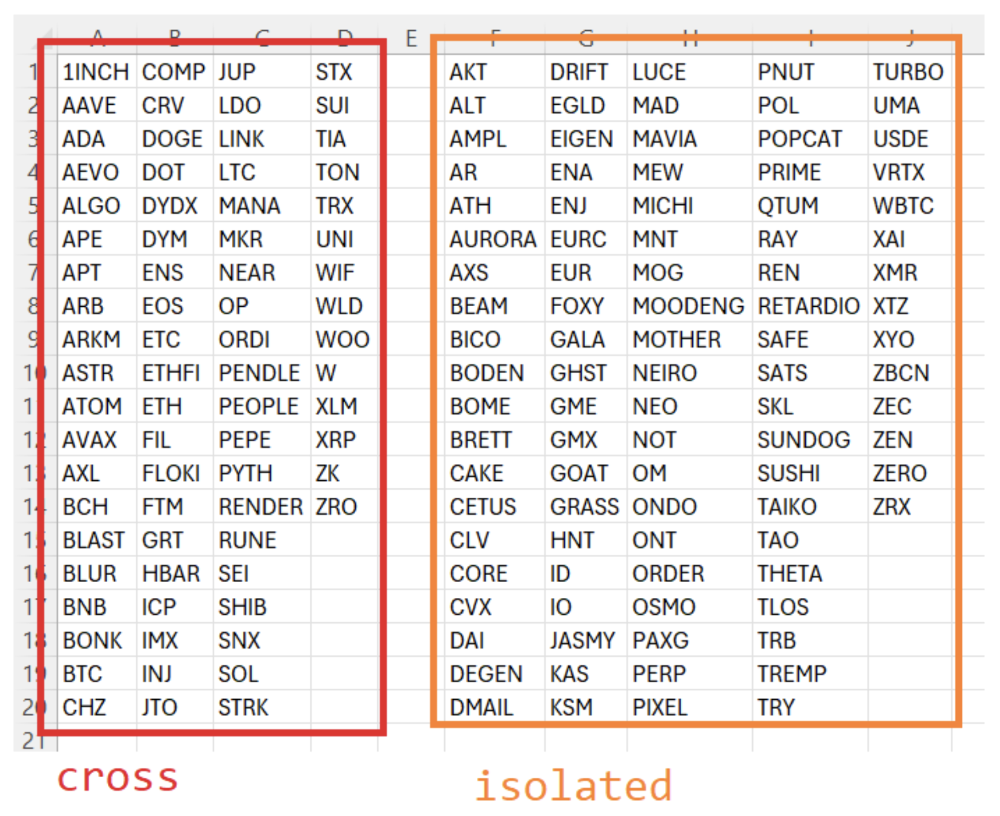
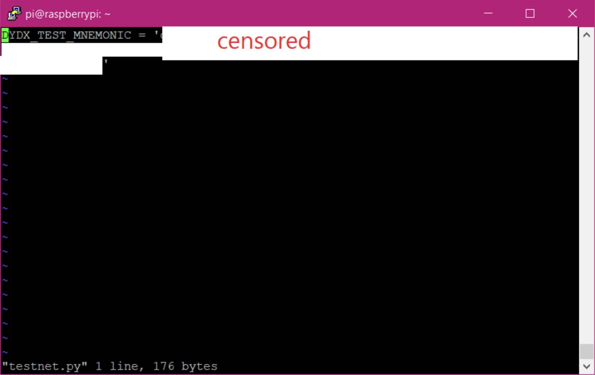
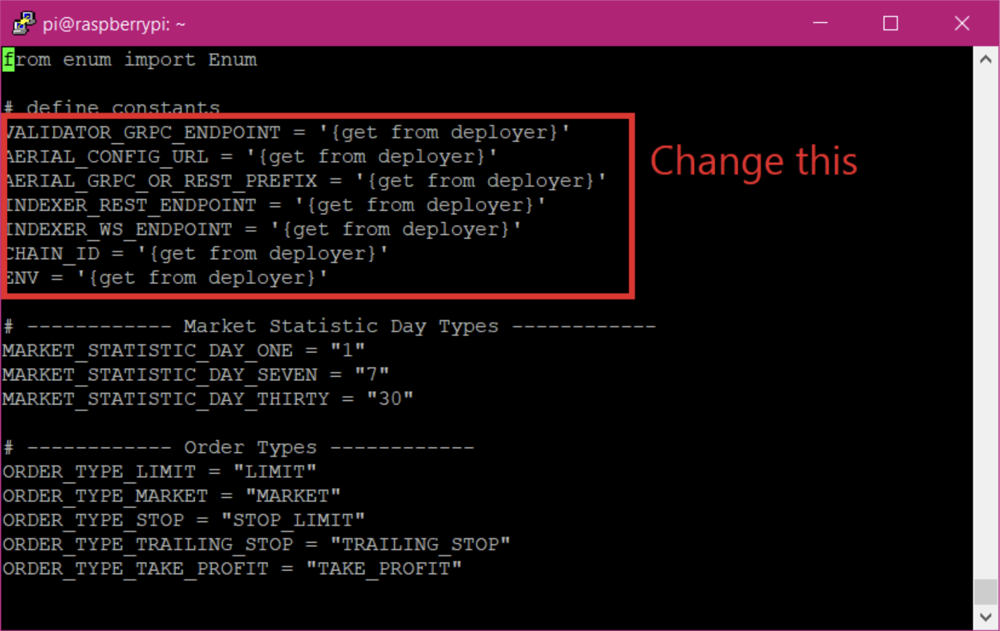
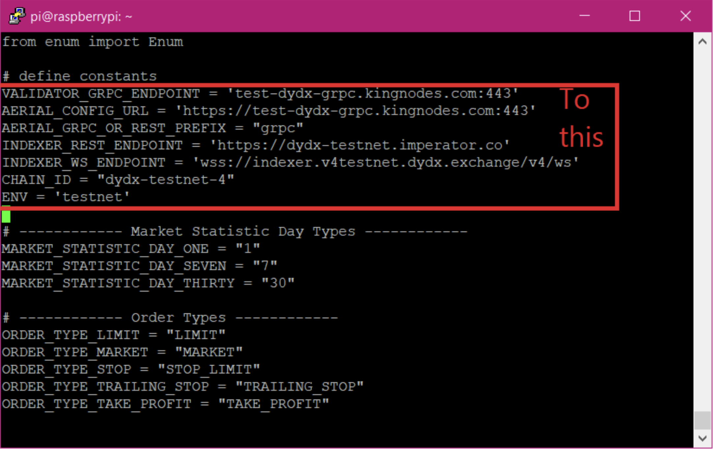

# API Trading with (Classic) v4 dYdX Python Client

## Pros and Cons of (Classic) V4 dYdX Python Client
1. Pro: Used by many traders already
2. Pro: Easy setup (this document)
3. Pro: Required for V4 dYdX CLI Tool
4. Con: Can only trade cross-margin markets in cross-margin mode.  As of December 3, 2024, the following markets are cross-margin capable or isolated-margin only.

## Requirements (Initial Setup)
1. Recommended OS: Ubuntu 22.04.4 LTS server (ubuntu-22.04.4-live-server-amd64.iso)
2. Install dependencies.

`sudo apt-get install python3-pip`

`pip3 install v4-proto`

`pip3 install python-dateutil`

`pip3 install bip_utils`

`pip3 install bech32`

`pip3 install websocket-client`

`git clone https://github.com/kaloureyes3/v4-clients`

3. Create a APIKEY file.  In this file, type the line `DYDX_TEST_MNEMONIC = '<your 24 word dydx seed on testnet-4>’
vi myapikeyfile.py'`

4. Add testnet parameters to API client:

`vi ./v4-clients/v4-client-py/v4_client_py/clients/constants.py`

`VALIDATOR_GRPC_ENDPOINT = 'test-dydx-grpc.kingnodes.com:443'`

`AERIAL_CONFIG_URL = 'https://test-dydx-grpc.kingnodes.com:443'`

`AERIAL_GRPC_OR_REST_PREFIX = "grpc"`

`INDEXER_REST_ENDPOINT = 'https://dydx-testnet.imperator.co'`

`INDEXER_WS_ENDPOINT = 'wss://indexer.v4testnet.dydx.exchange/v4/ws'`

`CHAIN_ID = "dydx-testnet-4"`

`ENV = 'testnet'`

5. Setup is complete.

## The V4 dYdX CLI Tool
1. Download the tool from https://github.com/chiwalfrm/solutions-public/tree/main/v4dydxcli
2. Refer to this document for instructions: https://docs.google.com/document/d/13aZz9o4g0WyLrteelBYDUOUmzJgOaPouVwRrF0kn-to/edit?usp=sharing
