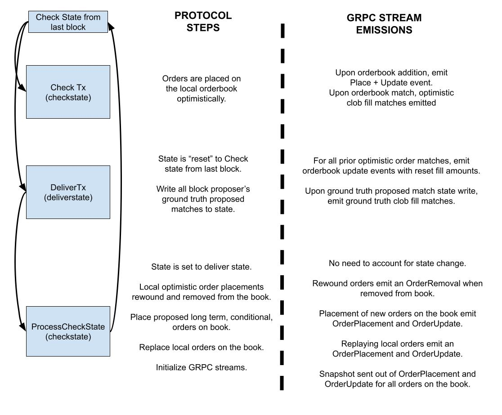

# Full Node gRPC Streaming

Last updated for: `v6.0.6`

Enable full node streaming to expose a stream of orderbook updates (L3), fills, taker orders, and subaccount updates, allowing clients to maintain a full view of the orderbook and various exchange activities. Note that the orderbook state can vary slightly between nodes due to dYdX's offchain orderbook design.


## Enabling Streaming
Full node streaming supports two streaming protocols. Information can be streamed via [gRPC](https://grpc.io/), a streaming RPC protocol developed by Google and used in CosmosSDK, or Websockets. Use the following flags to configure full node streaming features:

| CLI Flag | Type | Default | Short Explanation |
| -------- | ----- | ------- | -------- |
| grpc-streaming-enabled | bool | false | Toggle on to enable grpc-based full node streaming. |
| grpc-streaming-flush-interval-ms | int | 50 | Buffer flush interval for batch emission of protocol-side updates. |
| grpc-streaming-max-batch-size | int | 2000 | Maximum protocol-side update buffer before dropping all streaming connections. |
| grpc-streaming-max-channel-buffer-size | int | 2000 | Maximum channel size before dropping slow or erroring grpc connections. Decreasing this will more aggressively drop slow client connections. |
| websocket-streaming-enabled | bool | false | Toggle on to enable websocket-based streaming. Must be used in conjunction with `grpc-streaming-enabled`. |
| websocket-streaming-port | int | 9092 | Port number to expose for websocket streaming. |
| fns-snapshot-interval | int | 0 | If set to a nonzero number, snapshots will be sent out at this block interval. Used for debugging purposes. |


**Disclaimer:** We recommend you use this exclusively with your own node, as supporting multiple public gRPC streams with unknown client subscriptions may result in degraded performance.

## Connecting to the Stream

After setting up a full node with gRPC streaming enabled, you can connect to the stream using any gRPC client.
To follow along with [Google's documentation on gRPC streaming clients](https://grpc.io/docs/languages/go/basics/#client):

1. Clone the [github.com/dydxprotocol/v4-chain](https://github.com/dydxprotocol/v4-chain) repository at the same version as your full node.
2. Generate the protos: `make proto-gen && make proto-export-deps`.
3. The generated protos are now in the `.proto-export-deps` directory.
4. Use the protobuf compiler (protoc) to [generate stubs](https://protobuf.dev/getting-started/) in any supported language.
5. Follow [Google's documentation](https://grpc.io/docs/languages/go/basics/#client) to write a client that can read from the stream.
6. Connect to the stream defined in the `dydxprotocol.clob.Query` service ([StreamOrderbookUpdates](https://github.com/dydxprotocol/v4-chain/blob/4199c3e7b00ded24774d49ce8adcbaaa8325ddc1/proto/dydxprotocol/clob/query.proto#L63-L67)).

For Python, the corresponding code is already generated in [the v4-proto PyPi package](https://pypi.org/project/v4-proto/).

To connect via websocket, connect to the specified websocket server port at endpoint `/ws`. Default port number is `9092`, but it can be configured via cli flag. There are two query parameters. `clobPairIds` is a list of clob pair ids to subscribe to, and `subaccountIds` are a list of subaccount ids to subscribe to.

## Maintaining Orderbook and Subaccount State 

### Overview

1. Connect to the stream and subscribe to updates for a series of clob pair ids, each of which corresponds to a tradeable instrument, and subaccount ids, each of which corresponds to a subaccount.
2. Discard order messages until you receive a `StreamOrderbookUpdate` with `snapshot` set to `true`. This message contains the full orderbook state for each clob pair.
3. Similarly, discard subaccount messages until you receive a `StreamSubaccountUpdate` with `snapshot` set to `true`. This message contains the full subaccount state for each subscribed subaccount.
4. When you see an `OrderPlaceV1` message, insert the order into the book at the end of the queue on its price level. Track the order's initial quantums (quantity) and total filled quantums.
5. When you see an `OrderUpdateV1` message, update the order's total filled quantums.
6. When you see a `ClobMatch` (trade) message, update the total filled quantums for each maker order filled using the `fill_amounts` field. 
	- Note that, similar to `OrderUpdateV1`, the `fill_amounts` field represents the order's total filled quantity up to this point. This is not the amount filled in this specific match, but rather the cumulative amount filled across all matches for this order. 
    - The order's quantity remaining is always its initial quantity minus its total filled quantity.
    - Note that both `OrderUpdateV1` and `ClobMatch` messages must be processed to maintain the correct book state. See [OrderUpdateV1](#orderupdatev1) for details.
7. When you see an `OrderRemoveV1` message, remove the order from the book.
8. When you see a `StreamSubaccountUpdate` message with `snapshot` set to `false`, incrementally update the subaccount's balances and positions.
8. When you see a `StreamTakerOrder` message, state does not need to be updated. Taker orders are purely informational and are emitted whenever a taker order enters the matching loop, regardless of success or failure.

Note:
- The order subticks (price) and quantums (quantity) fields are encoded as integers and 
  require [translation to human-readable values](https://github.com/dydxprotocol/grpc-stream-client/blob/d8cbbc3c6aeb454078c72204491727b243c26e19/src/market_info.py#L1).
- Each node's view of the book is subjective, because order messages arrive at different nodes in different orders. When a block is proposed, nodes "sync" subsets of their book states to cohere with the trades seen by the block proposer.
- Only `ClobMatch` messages with `execModeFinalize` are trades confirmed by consensus.
	- Use all `ClobMatch` messages to update the orderbook state. The node's book state is optimistic, and reverts if fills are not confirmed, in which case a series of `OrderRemoveV1`, `OrderPlaceV1` and `OrderUpdateV1` messages are sent to represent the modifications to the full node's book state.
    - Treat only `ClobMatch` messages with `execModeFinalize` as confirmed trades.
    - See [Reference Material](#reference-material) for more information.


### Request / Response

To subscribe to the stream, the client can send a 'StreamOrderbookUpdatesRequest' specifying the clob pair ids and subaccount ids to subscribe to.

<details>

<summary>Protobuf Structs</summary>

```protobuf
// StreamOrderbookUpdatesRequest is a request message for the
// StreamOrderbookUpdates method.
message StreamOrderbookUpdatesRequest {
  // Clob pair ids to stream orderbook updates for.
  repeated uint32 clob_pair_id = 1;

  // Subaccount ids to stream subaccount updates for.
  repeated dydxprotocol.subaccounts.SubaccountId subaccount_ids = 2;
}
```
</details>
&nbsp;

Response will contain a `oneof` field that contains either:
- `StreamOrderbookUpdate`
	- Contains one or more `OffChainUpdateV1` orderbook updates (Add/Remove/Update)
	- boolean field indicating if the updates are coming from a snapshot or not.
- `StreamOrderbookFill`
	- Contains a singular `ClobMatch` object describing a fill (order or liquidation).
		- Represents one taker order matched with 1 or more maker orders.
		- Matched quantums are provided for each pair in the match.
	- `orders` field contains full order information at time of matching. Contains all maker and taker orders involved in the `ClobMatch` object.
		- Prices within a Match are matched at the maker order price.
	- `fill_amounts` contains the absolute, total filled quantums of each order as stored in state.
		- fill_amounts should be zipped together with the `orders` field. Both arrays should have the same length.
- `StreamTakerOrder`
  - Contains a oneof `TakerOrder` field which represents the order that entered the matching loop.
    - Could be a regular order or a Liquidation Order.
  - Contains a `StreamTakerOrderStatus` field which represents the status of a taker order after it has finished the matching loop.
    - `OrderStatus` is a uint32 describing the result of the taker order matching. Only value `0` indicates success. Possible values found [here](https://github.com/dydxprotocol/v4-chain/blob/main/protocol/x/clob/types/orderbook.go#L118-L152).
      - @jonfung to update to static link
    - `RemainingQuantums` represents the remaining amount of non-matched quantums for the taker order.
    - `OptimisticallyFilledQuantums` represents the number of quantums filled *during this matching loop*. It does not include quantums filled before this matching loop, if the order was a replacement order and was previously filled.
- `StreamSubaccountUpdate`
  - Contains a singular `SubaccountId` object to identify the subaccount.
  - multiple `SubaccountPerpetualPosition`s to represent the perpetual positions of the subaccount.
    - each `SubaccountPerpetualPosition` contains a perpetual id and the size of the position in base quantums.
  - multiple `SubaccountAssetPosition`s to represent the asset positions of the subaccount. (i.e, usdc collateral positions)
    - each `SubaccountAssetPosition` contains an asset id and the size of the position in base quantums.

as well as `block_height` and `exec_mode` (see [Exec Modes Reference](#exec-mode-reference)). 

<details>

<summary>Protobuf Structs</summary>

```protobuf
// StreamOrderbookUpdatesResponse is a response message for the
// StreamOrderbookUpdates method.
message StreamOrderbookUpdatesResponse {
  // Batch of updates for the clob pair.
  repeated StreamUpdate updates = 1 [ (gogoproto.nullable) = false ];
}

// StreamUpdate is an update that will be pushed through the
// gRPC stream.
message StreamUpdate {
  // Contains one of an StreamOrderbookUpdate,
  // StreamOrderbookFill, StreamTakerOrderStatus, StreamSubaccountUpdate.
  oneof update_message {
    StreamOrderbookUpdate orderbook_update = 1;
    StreamOrderbookFill order_fill = 2;
    StreamTakerOrder taker_order = 3;
    dydxprotocol.subaccounts.StreamSubaccountUpdate subaccount_update = 4;
  }

  // Block height of the update.
  uint32 block_height = 5;

  // Exec mode of the update.
  uint32 exec_mode = 6;
}

// StreamOrderbookUpdate provides information on an orderbook update. Used in
// the full node gRPC stream.
message StreamOrderbookUpdate {
  // Orderbook updates for the clob pair. Can contain order place, removals,
  // or updates.
  repeated dydxprotocol.indexer.off_chain_updates.OffChainUpdateV1 updates = 1
      [ (gogoproto.nullable) = false ];

  // Snapshot indicates if the response is from a snapshot of the orderbook.
  // This is true for the initial response and false for all subsequent updates.
  // Note that if the snapshot is true, then all previous entries should be
  // discarded and the orderbook should be resynced.
  bool snapshot = 2;
}

// StreamOrderbookFill provides information on an orderbook fill. Used in
// the full node gRPC stream.
message StreamOrderbookFill {
  // Clob match. Provides information on which orders were matched
  // and the type of order.
  ClobMatch clob_match = 1;

  // All orders involved in the specified clob match. Used to look up
  // price of a match through a given maker order id.
  repeated Order orders = 2 [ (gogoproto.nullable) = false ];

  // Resulting fill amounts for each order in the orders array.
  repeated uint64 fill_amounts = 3 [ (gogoproto.nullable) = false ];
}

// StreamTakerOrder provides information on a taker order that was attempted
// to be matched on the orderbook.
// It is intended to be used only in full node streaming.
message StreamTakerOrder {
  // The taker order that was matched on the orderbook. Can be a
  // regular order or a liquidation order.
  oneof taker_order {
    Order order = 1;
    StreamLiquidationOrder liquidation_order = 2;
  }

  // Information on the taker order after it is matched on the book,
  // either successfully or unsuccessfully.
  StreamTakerOrderStatus taker_order_status = 3;
}

// StreamTakerOrderStatus is a representation of a taker order
// after it is attempted to be matched on the orderbook.
// It is intended to be used only in full node streaming.
message StreamTakerOrderStatus {
  // The state of the taker order after attempting to match it against the
  // orderbook. Possible enum values can be found here:
  // https://github.com/dydxprotocol/v4-chain/blob/main/protocol/x/clob/types/orderbook.go#L105
  uint32 order_status = 1;

  // The amount of remaining (non-matched) base quantums of this taker order.
  uint64 remaining_quantums = 2;

  // The amount of base quantums that were *optimistically* filled for this
  // taker order when the order is matched against the orderbook. Note that if
  // any quantums of this order were optimistically filled or filled in state
  // before this invocation of the matching loop, this value will not include
  // them.
  uint64 optimistically_filled_quantums = 3;
}

// StreamSubaccountUpdate provides information on a subaccount update. Used in
// the full node GRPC stream.
message StreamSubaccountUpdate {
  SubaccountId subaccount_id = 1;
  // updated_perpetual_positions will each be for unique perpetuals.
  repeated SubaccountPerpetualPosition updated_perpetual_positions = 2;
  // updated_asset_positions will each be for unique assets.
  repeated SubaccountAssetPosition updated_asset_positions = 3;
  // Snapshot indicates if the response is from a snapshot of the subaccount.
  // All updates should be ignored until snapshot is received.
  // If the snapshot is true, then all previous entries should be
  // discarded and the subaccount should be resynced.
  // For a snapshot subaccount update, the `updated_perpetual_positions` and
  // `updated_asset_positions` fields will contain the full state of the
  // subaccount.
  bool snapshot = 4;
}

// SubaccountPerpetualPosition provides information on a subaccount's updated
// perpetual positions.
message SubaccountPerpetualPosition {
  // The `Id` of the `Perpetual`.
  uint32 perpetual_id = 1;
  // The size of the position in base quantums.
  uint64 quantums = 2;
}

// SubaccountAssetPosition provides information on a subaccount's updated asset
// positions.
message SubaccountAssetPosition {
  // The `Id` of the `Asset`.
  uint32 asset_id = 1;
  // The absolute size of the position in base quantums.
  uint64 quantums = 2;
}
```
</details>


After subscribing to the orderbook updates, use the orderbook in the snapshot as the starting orderbook.
Similarly, use the subaccount state in the snapshot as the starting subaccount state.

### OrderPlaceV1
When `OrderPlaceV1` is received,  add the corresponding order to the end of the price level.
- This message is only used to modify the orderbook data structure (Bids, Asks).
- This message is sent out whenever an order is added to the in-memory orderbook.
- This may occur in various places such as when an order is initially placed, or when an order is replayed during the ProcessCheckState step.
- An `OrderPlaceV1` message is always be followed by an `OrderUpdateV1` message, which sets the intial fill amount (typically zero).

<details>

<summary>Code Snippet</summary>

```go
func (l *LocalOrderbook) AddOrder(order v1types.IndexerOrder) {
	l.Lock()
	defer l.Unlock()

	if _, ok := l.OrderIdToOrder[order.OrderId]; ok {
		l.Logger.Error("order already exists in orderbook")
	}

	subticks := order.GetSubticks()
	if order.Side == v1types.IndexerOrder_SIDE_BUY {
		if _, ok := l.Bids[subticks]; !ok {
			l.Bids[subticks] = make([]v1types.IndexerOrder, 0)
		}
		l.Bids[subticks] = append(l.Bids[subticks], order)
	} else {
		if _, ok := l.Asks[subticks]; !ok {
			l.Asks[subticks] = make([]v1types.IndexerOrder, 0)
		}
		l.Asks[subticks] = append(l.Asks[subticks], order)
	}

	l.OrderIdToOrder[order.OrderId] = order
	l.OrderRemainingAmount[order.OrderId] = 0
}
```
</details>

### OrderUpdateV1
When `OrderUpdateV1` is received, update the order's fill amount to the amount specified.
- This message is only used to update fill amounts. It carries information about an order's updated fill amount.
- This message is emitted when an order's fill amount changes due to something other than a `ClobMatch`.
    - This includes when deliverState is reset to the checkState from last block, or when branched state is written to and then discarded if there was a matching error.
    - For example, this could happen if the full node sees the order filled, and then the next block committed by consensus does not contain the expected fill, so the order’s quantity remaining resets to its state from the previous block.
- An update message will always accompany an order placement message.
- It's possible for an update message to be sent before a placement message. You can safely ignore update messages with order ids not in the orderbook.
- **Note that you must handle both `OrderUpdateV1` and `ClobMatch` messages to maintain the correct book state**.

<details>

<summary>Code Snippet</summary>

```go
func (l *LocalOrderbook) SetOrderFillAmount(
	orderId *v1types.IndexerOrderId,
	fillAmount uint64,
) {
	l.Lock()
	defer l.Unlock()

	if fillAmount == 0 {
		delete(l.FillAmounts, *orderId)
	} else {
		l.FillAmounts[*orderId] = fillAmount
	}
}
```
</details>


### OrderRemoveV1
When `OrderRemoveV1` is received, remove the order from the orderbook.
- This message is only used to modify the orderbook data structure (Bids, Asks).
- This message is emitted when an order is removed from the in-memory orderbook.
- Note that this does not mean the fills are removed from state yet.
	- When fills are removed from state, a separate Update message will be sent with 0 quantum.

<details>

<summary>Code Snippet</summary>

```go
func (l *LocalOrderbook) RemoveOrder(orderId v1types.IndexerOrderId) {
	l.Lock()
	defer l.Unlock()

	if _, ok := l.OrderIdToOrder[orderId]; !ok {
		l.Logger.Error("order not found in orderbook")
	}

	order := l.OrderIdToOrder[orderId]
	subticks := order.GetSubticks()

	if order.Side == v1types.IndexerOrder_SIDE_BUY {
		for i, o := range l.Bids[subticks] {
			if o.OrderId == order.OrderId {
				l.Bids[subticks] = append(
					l.Bids[subticks][:i],
					l.Bids[subticks][i+1:]...,
				)
				break
			}
		}
		if len(l.Bids[subticks]) == 0 {
			delete(l.Bids, subticks)
		}
	} else {
		for i, o := range l.Asks[subticks] {
			if o.OrderId == order.OrderId {
				l.Asks[subticks] = append(
					l.Asks[subticks][:i],
					l.Asks[subticks][i+1:]...,
				)
				break
			}
		}
		if len(l.Asks[subticks]) == 0 {
			delete(l.Asks, subticks)
		}
	}
	delete(l.OrderIdToOrder, orderId)
}
```

</details>

### StreamOrderbookFill/ClobMatch
This message is only used to update fill amounts, it does not add or remove orders from the book but can change the quantity remaining for open orders.

The `ClobMatch` data structure contains either a `MatchOrders` or a `MatchPerpetualLiquidation` object. Match Deleveraging events are not emitted. Within each Match object, a `MakerFill` array contains the various maker orders that matched with the singular taker order and the amount of quantums matched.

Note that all matches occur at the maker order price. The `orders` field in the `StreamOrderbookFill` object allow for price lookups based on order id. It contains all the maker order ids, and in the case of non-liquidation orders, it has the taker order.

Mapping each order in `orders` to the corresponding value in the `fill_amounts` field provides the absolute filled amount of quantums that each order is filled to after the ClobMatch was processed. 


<details>

<summary>Code Snippet</summary>

```go
// fillAmountMap is a map of order ids to fill amounts.
// The SetOrderFillAmount code can be found in `the `OrderUpdateV1` section.
func (c *GrpcClient) ProcessMatchOrders(
	matchOrders *clobtypes.MatchOrders,
	orderMap map[clobtypes.OrderId]clobtypes.Order,
	fillAmountMap map[clobtypes.OrderId]uint64,
) {
	takerOrderId := matchOrders.TakerOrderId
	clobPairId := takerOrderId.GetClobPairId()
	localOrderbook := c.Orderbook[clobPairId]

	indexerTakerOrder := v1.OrderIdToIndexerOrderId(takerOrderId)
	localOrderbook.SetOrderFillAmount(&indexerTakerOrder, fillAmountMap[takerOrderId])

	for _, fill := range matchOrders.Fills {
		makerOrder := orderMap[fill.MakerOrderId]
		indexerMakerOrder := v1.OrderIdToIndexerOrderId(makerOrder.OrderId)
		localOrderbook.SetOrderFillAmount(&indexerMakerOrder, fillAmountMap[makerOrder.OrderId])
	}
}

func (c *GrpcClient) ProcessMatchPerpetualLiquidation(
	perpLiquidation *clobtypes.MatchPerpetualLiquidation,
	orderMap map[clobtypes.OrderId]clobtypes.Order,
	fillAmountMap map[clobtypes.OrderId]uint64,
) {
	localOrderbook := c.Orderbook[perpLiquidation.ClobPairId]
	for _, fill := range perpLiquidation.GetFills() {
		makerOrder := orderMap[fill.MakerOrderId]
		indexerMakerOrderId := v1.OrderIdToIndexerOrderId(makerOrder.OrderId)
		localOrderbook.SetOrderFillAmount(&indexerMakerOrderId, fillAmountMap[makerOrder.OrderId])
	}
}
```

</details>

### StreamSubaccountUpdate
This message is used to update subaccount balances and positions.

The initial message for a subaccount will have `snapshot` set to `true`. This message contains the full state of the subaccount. All updates should be ignored until the snapshot is received. Subsequent updates will contain updates to the positions and balances of the subaccount. They should be merged in with the existing state of the subaccount.

Apart from the initial snapshot, this mesage will only be sent out for subaccount updates that are in consensus.

<details>

<summary>Code Snippet</summary>

```go
type SubaccountId struct {
    Owner  string
    Number int
}

type SubaccountPerpetualPosition struct {
    PerpetualId int
    Quantums    int
}

type SubaccountAssetPosition struct {
    AssetId  int
    Quantums int
}

type SubaccountState struct {
    SubaccountId       SubaccountId
    PerpetualPositions map[int]SubaccountPerpetualPosition
    AssetPositions     map[int]SubaccountAssetPosition
}

func (c *GrpcClient) ProcessSubaccountUpdate(
    subaccountUpdate *satypes.StreamSubaccountUpdate,
    subaccountMap map[satypes.SubaccountId]SubaccountState,
) {
    // Extract the subaccount ID from the update
    subaccountId := *subaccountUpdate.SubaccountId

    // Check if this is a snapshot
    if subaccountUpdate.Snapshot {
        // Replace the entire subaccount state with the snapshot data
        subaccountState := SubaccountState{
            SubaccountId:       subaccountId,
            PerpetualPositions: make(map[int]SubaccountPerpetualPosition),
            AssetPositions:     make(map[int]SubaccountAssetPosition),
        }

        // Populate perpetual positions from snapshot
        for _, perpPositionUpdate := range subaccountUpdate.UpdatedPerpetualPositions {
            subaccountState.PerpetualPositions[perpPositionUpdate.PerpetualId] = *perpPositionUpdate
        }

        // Populate asset positions from snapshot
        for _, assetPositionUpdate := range subaccountUpdate.UpdatedAssetPositions {
            subaccountState.AssetPositions[assetPositionUpdate.AssetId] = *assetPositionUpdate
        }

        // Update the map with the new snapshot state
        subaccountMap[subaccountId] = subaccountState
    } else {
        // If not a snapshot, retrieve or initialize the current subaccount state
        subaccountState, exists := subaccountMap[subaccountId]
        if !exists {
            subaccountState = SubaccountState{
                SubaccountId:       subaccountId,
                PerpetualPositions: make(map[int]SubaccountPerpetualPosition),
                AssetPositions:     make(map[int]SubaccountAssetPosition),
            }
        }

        // Update perpetual positions
        for _, perpPositionUpdate := range subaccountUpdate.UpdatedPerpetualPositions {
            if perpPositionUpdate.Quantums != 0 {
                subaccountState.PerpetualPositions[perpPositionUpdate.PerpetualId] = *perpPositionUpdate
            } else {
                // Delete the entry if the position size is zero
                delete(subaccountState.PerpetualPositions, perpPositionUpdate.PerpetualId)
            }
        }

        // Update asset positions
        for _, assetPositionUpdate := range subaccountUpdate.UpdatedAssetPositions {
            if assetPositionUpdate.Quantums != 0 {
                subaccountState.AssetPositions[assetPositionUpdate.AssetId] = *assetPositionUpdate
            } else {
                // Delete the entry if the asset quantity is zero
                delete(subaccountState.AssetPositions, assetPositionUpdate.AssetId)
            }
        }

        // Update the map with the modified state
        subaccountMap[subaccountId] = subaccountState
    }
}
```

</details>

### StreamTakerOrder

This message is purely an informational message used to indicate whenever a taker order is matched against the orderbook. No internal state in clients need to be updated.

Information provided in the struct:
- One of (taker order, liquidation order) entering matching loop
- Status of order after matching. If order failed to match, status code provides the reason for failure (i.e post only order crosses book)
- Remaining non-matched quantums for the taker order
- Quantity of optimistically matched quantums during this matching order loop.

Note that by protocol design, all `StreamTakerOrderStatus` emissions will be optimistic from CheckTx state. This is due to the fact that each node maintains it's own orderbook, thus all matching operations when a taker order enters the matching loop will be optimistic. If confirmed fill amounts in consensus are desired, `StreamOrderbookFill` objects will be emitted during DeliverTx for proposed blocks.

<details>

<summary>Code Snippet</summary>

```go
type StreamTakerOrderStatus struct {
	OrderStatus uint32
	RemainingQuantums uint64
	OptimisticallyFilledQuantums uint64
}

func (c *GrpcClient) ProcessStreamTakerOrder(
    streamTakerOrder *satypes.StreamTakerOrder,
) {
	takerOrder := streamTakerOrder.GetOrder()
	takerOrderLiquidation := streamTakerOrder.GetLiquidationOrder()
	takerOrderStatus := streamTakerOrder.GetTakerOrderStatus()
	if takerOrderStatus.OrderStatus == 0 || takerOrderStatus.OrderStatus == 0 {
		if takerOrder != nil {
			// Process success of regular taker order
		}
		if takerOrderLiquidation != nil {
			// Process success of liquidation taker order
		}
	}
}
```

</details>

## Reference Material

### Optimistic Orderbook Execution

By protocol design, each validator has their own version of the orderbook and optimistically processes orderbook matches. As a result, you may see interleaved sequences of order removals, placements, and state fill amount updates when optimistically processed orderbook matches are removed and later replayed on the local orderbook.



Note that DeliverTx maps to exec mode `execModeFinalize`.

### Staged DeliverTx Validation

In DeliverTx, all of the updates emitted are finalized and in consensus. A batch of updates will be sent out in the same `StreamOrderbookUpdatesResponse` object. In consensus, fills and subaccount updates will be emitted.

### Finalized Subaccount Updates

Only finalized subaccount updates are sent. Snapshots are sent during PrepareCheckState, so the execMode will be set to `102` for subaccount snapshots. Finalized incremental subaccount updates are sent with execMode `7`.

### Exec Mode Reference
<details>

<summary>Exec Modes</summary>

```go
	execModeCheck               = 0 // Check a transaction
	execModeReCheck             = 1 // Recheck a (pending) transaction after a commit
	execModeSimulate            = 2 // Simulate a transaction
	execModePrepareProposal     = 3 // Prepare a block proposal
	execModeProcessProposal     = 4 // Process a block proposal
	execModeVoteExtension       = 5 // Extend or verify a pre-commit vote
	execModeVerifyVoteExtension = 6 // Verify a vote extension
	execModeFinalize            = 7 // Finalize a block proposal
	ExecModeBeginBlock          = 100
	ExecModeEndBlock            = 101
	ExecModePrepareCheckState   = 102
```
</details>
<br>

### Taker Order Status Reference

Values are defined in code [here](https://github.com/dydxprotocol/v4-chain/blob/main/protocol/x/clob/types/orderbook.go#L118-L152).
  - @jonfung to update to static link

| Value    | Status | Description |
| -------- | ------ | ------- |
| 0  |  Success  | Order was successfully matched and/or added to the orderbook.|
| 1  |  Undercollateralized  | Order failed collateralization checks when matching or placed on orderbook. Order was cancelled. |
| 2  |  InternalError  | Order caused internal error and was cancelled. |
| 3  |  ImmediateOrCancelWouldRestOnBook  | Order is an IOC order that would have been placed on the orderbook. Order was cancelled. |
| 4  |  ReduceOnlyResized  | Order was resized since it would have changed the user's position size. |
| 5  |  LiquidationRequiresDeleveraging  | Not enough liquidity to liquidate the subaccount profitably on the orderbook. Order was not fully matched because insurance fund did not have enough funds to cover losses from performing liquidation. Subaccount requires deleveraging. |
| 6  |  LiquidationExceededSubaccountMaxNotionalLiquidated  | Liquidation order could not be matched because it exceeds the max notional liquidated in this block. |
| 7  |  LiquidationExceededSubaccountMaxInsuranceLost  | Liquidation order could not be matched because it exceeds the max funds lost for hte insurance fund in this block. |
| 8  |  ViolatesIsolatedSubaccountConstraints  | Matching this order would lead to the subaccount violating isolated perpetual constraints. Order was cancelled. |
| 9  |  PostOnlyWouldCrossMakerOrder  | Matching this order would lead to the post only taker order crossing the orderbook. Order wasa cancelled. |

<br>

### Example Scenario

- Trader places a bid at price 100 for size 1
  - OrderPlace, price = 100, size = 1
  - OrderUpdate, total filled amount = 0
- Trader replaces that original bid to be price 99 at size 2
  - OrderRemove
  - OrderPlace, price = 99, size = 2
  - OrderUpdate, total filled amount = 0
- Another trader submits an IOC ask at price 100 for size 1.
  - Full node doesn't see this matching anything so no updates.
- Block is confirmed that there was a fill for the trader's original order at price 100 for size 1 (block proposer didn't see the order replacement)
  - OrderUpdate, set total fill amount to be 0 (no-op) from checkState -> deliverState reset
  - MatchOrder emitted for block proposer's original order match, total filled amount = 1

### Metrics and Logs

| Metric | Type | Explanation |
| -------- | ----- | ------- |
| grpc_send_orderbook_updates_latency.quantile | histogram | Latency for each orderbook cache buffer enqueue |
| grpc_send_orderbook_updates_latency.count | count | number orderbook updates enqueued in cache buffer |
| grpc_send_orderbook_snapshot_latency.quantile | histogram | Latency for each snapshot orderbook emission |
| grpc_send_orderbook_snapshot_latency.count | count | number of order book snapshots emitted |
| grpc_send_subaccount_update_count | count | Number of subaccount updates emitted |
| grpc_send_orderbook_fills_latency.quantile | histogram | Latency for each orderbook fill cache buffer enqueue |
| grpc_send_orderbook_fills_latency.count | count | number orderbook snapshots enqueued in cache buffer |
| grpc_add_update_to_buffer_count | count | Number of total update objects added to the cache buffer |
| grpc_add_to_subscription_channel_count | count | Number of updates added to each per-subscription channel buffer. Tagged by `subscription_id`. |
| grpc_send_response_to_subscriber_count | count | Number of updates sent from each per-subscription channel buffer to the client. Tagged by `subscription_id`. |
| grpc_stream_subscriber_count | count | number of streaming connections currently connected to the full node |
| grpc_stream_num_updates_buffered | histogram | number of updates in the full node's buffer cache of updates. Once this hits `grpc-streaming-max-batch-size`, all subscriptions will be dropped. Use with `quantile:0.99` in order to observe maximum amount of updates. |
| grpc_flush_updates_latency.count | count | number of times the buffer cache is flushed. |
| grpc_flush_updates_latency.quantile | histogram | Latency of each buffer cache flush call into subscription channel. |
| grpc_subscription_channel_length.quantile | histogram | Length of each subscription's channel buffer. Tagged by `subscription_id`. Use with `quantile:0.99` in order to observe subscription channel length for subscription ids. Once this hits `grpc-streaming-max-channel-buffer-size`, the offending subscription will be dropped. |

All logs from grpc streaming are tagged with `module: full-node-streaming`.

### Protocol-side buffering and Slow gRPC Client Connections

The full node maintains a length-configurable buffer cache of streaming updates to ensure bursts of protocol updates do not induce full node lag. If the buffer reaches maximum capacity, all connections and updates are dropped, and subscribers will have to re-subscribe. The buffer is periodically flushed into each per-subscription golang channel at a configurable set interval of time, defaulting to 50ms.

To ensure slow client connections do not induce full node lag, each client subscription has a unique goroutine and golang channel that pushes updates through the grpc stream. If the channel buffer grows beyond the configurable `grpc-streaming-max-channel-buffer-size` parameter, the goroutine will be stopped. With the poller gone, the channel buffer will eventually grow and hit the max buffer size, at which the lagging subscription is pruned.

Metrics and logs are emitted to help tune both of these parameters.

### FAQs

Q: Suppose the full node saw the cancellation of order X at t0 before the placement of the order X at t1. What would the updates be like?
- **A: No updates because the order was never added to the book**

Q: A few questions because it often results in crossed books:
In which cases shall we not expect to see OrderRemove message?
- Post only reject? → **PO reject won’t have a removal since they were never added to the book**
- IOC/FOK auto cancel? → **IOC/FOK also won’t have a removal message for similar reason**
- Order expired outside of block window? → **expired orders will generate a removal message**
- Passive limit order was fully filled → **fully filled maker will generate a removal message**
- Aggressive limit order was fully filled? → **fully filled taker won’t have a removal**

Q: Why does `StreamOrderbookUpdate` use IndexerOrderId and `StreamOrderbookFill` use dydxprotocol.OrderId?
- A: gRPC streaming exposes inner structs of the matching engine and our updates are processed differently from fills. The two data structures have equivalent fields, and a lightweight translation layer to go from Indexer OrderId to Protocol OrderId can be written.

Q: I only want to listen to confirmed updates. I do not want to process optimistic fills.
- A: You will want to only process messages from DeliverTx stage (`execModeFinalize`). This step is when we save proposed matches from the block proposer into state. These updates will have exec mode execModeFinalize.

Q: Why do I see an Order Update message for a new OrderId before an Order Place message?
- A: During DeliverTx, the first step we do is to reset fill amounts (via OrderUpdate messages) for all orders involved in the proposed and local operations queue due to the deliver state being reset to the check state from last block. We "reset" fill order amounts to 0 for orders that the block proposer has seen but has not gossiped to our full node yet. In the future, we may reduce the number of messages that are sent, but for now we are optimizing for orderbook correctness.

Q: How do I print the gRPC stream at the command line?
- A: Use the [grpcurl](https://github.com/fullstorydev/grpcurl) tool. Connect to a full node stream with:
	```
	grpcurl -plaintext -d '{"clobPairId":[0,1], "subaccountIds": [{"owner": "dydx1nzuttarf5k2j0nug5yzhr6p74t9avehn9hlh8m", "number": 0}]}' 127.0.0.1:9090 dydxprotocol.clob.Query/StreamOrderbookUpdates
	```

Q: Is there a sample client?
- A: Example client which subscribes to the stream and maintains a local orderbook: [dydxprotocol/grpc-stream-client](https://github.com/dydxprotocol/grpc-stream-client/)

## Changelog

### v6.0.6
- added taker order message to stream
- added subaccount update message to stream
- Finalized DeliverTx updates are all batched together in a single message
- Metrics modifications
- Websocket support

### v5.0.5
- added update batching and per-channel channel/goroutines to not block full node on laggy subscriptions
- Protobuf breaking change: Shifted block height and exec mode from `StreamOrderbookUpdatesResponse` to `StreamUpdate`
- Metrics
