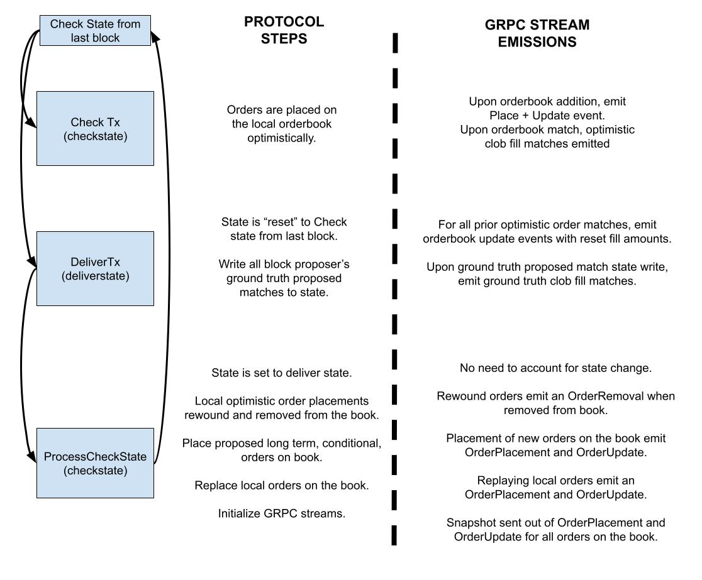

# Full Node gRPC Streaming

Last updated for: `v5.0.5`

Enable full node gRPC streaming to expose a stream of orderbook updates (L3) and fills, allowing clients to maintain a full view of the orderbook. Note that the orderbook state can vary slightly between nodes due to dYdX's offchain orderbook design.


## Enabling Streaming
The orderbook stream is implemented with [gRPC](https://grpc.io/), a streaming RPC protocol developed by Google and used in CosmosSDK. Use the following flags to configure the gRPC streaming feature:

| CLI Flag | Type | Default | Short Explanation |
| -------- | ----- | ------- | -------- |
| grpc-streaming-enabled | bool | false | Toggle on to enable full node streaming. Can only be used when grpc is enabled. |
| grpc-streaming-flush-interval-ms | int | 50 | Buffer flush interval for batch emission of protocol-side updates |
| grpc-streaming-max-batch-size | int | 2000 | Maximum protocol-side update buffer before dropping all streaming connections|
| grpc-streaming-max-channel-buffer-size | int | 2000 | Maximum channel size before dropping slow or erroring grpc connections. Decreasing this will more aggressively drop slow client connections. |

**Disclaimer:** We recommend you use this exclusively with your own node, as supporting multiple public gRPC streams with unknown client subscriptions may result in degraded performance.

## Connecting to the Stream

After setting up a full node with gRPC streaming enabled, you can connect to the stream using any gRPC client.
To follow along with [Google's documentation on gRPC streaming clients](https://grpc.io/docs/languages/go/basics/#client):

1. Clone the [github.com/dydxprotocol/v4-chain](https://github.com/dydxprotocol/v4-chain) repository at the same version as your full node.
2. Generate the protos: `make proto-gen && make proto-export-deps`.
3. The generated protos are now in the `.proto-export-deps` directory.
4. Use the protobuf compiler (protoc) to [generate stubs](https://protobuf.dev/getting-started/) in any supported language.
5. Follow [Google's documentation](https://grpc.io/docs/languages/go/basics/#client) to write a client that can read from the stream.
6. Connect to the stream defined in the `dydxprotocol.clob.Query` service ([StreamOrderbookUpdates](https://github.com/dydxprotocol/v4-chain/blob/4199c3e7b00ded24774d49ce8adcbaaa8325ddc1/proto/dydxprotocol/clob/query.proto#L63-L67)).

For Python, the corresponding code is already generated in [the v4-proto PyPi package](https://pypi.org/project/v4-proto/).

## Maintaining Orderbook State 

### Overview

1. Connect to the stream and subscribe to updates for a series of clob pair ids, each of which corresponds to a tradeable instrument.
2. Discard messages until you receive a `StreamOrderbookUpdate` with `snapshot` set to `true`. This message contains the full orderbook state for each clob pair.
3. When you see an `OrderPlaceV1` message, insert the order into the book at the end of the queue on its price level. Track the order's initial quantums (quantity) and total filled quantums.
4. When you see an `OrderUpdateV1` message, update the order's total filled quantums.
5. When you see a `ClobMatch` (trade) message, update the total filled quantums for each maker order filled using the `fill_amounts` field. 
	- Note that, similar to `OrderUpdateV1`, the `fill_amounts` field represents the order's total filled quantity up to this point. This is not the amount filled in this specific match, but rather the cumulative amount filled across all matches for this order. 
    - The order's quantity remaining is always its initial quantity minus its total filled quantity.
    - Note that both `OrderUpdateV1` and `ClobMatch` messages must be processed to maintain the correct book state. See [OrderUpdateV1](#orderupdatev1) for details.
6. When you see an `OrderRemoveV1` message, remove the order from the book.

Note:
- The order subticks (price) and quantums (quantity) fields are encoded as integers and 
  require [translation to human-readable values](https://github.com/dydxprotocol/grpc-stream-client/blob/d8cbbc3c6aeb454078c72204491727b243c26e19/src/market_info.py#L1).
- Each node's view of the book is subjective, because order messages arrive at different nodes in different orders. When a block is proposed, nodes "sync" subsets of their book states to cohere with the trades seen by the block proposer.
- Only `ClobMatch` messages with `execModeFinalize` are trades confirmed by consensus.
	- Use all `ClobMatch` messages to update the orderbook state. The node's book state is optimistic, and reverts if fills are not confirmed, in which case a series of `OrderRemoveV1`, `OrderPlaceV1` and `OrderUpdateV1` messages are sent to represent the modifications to the full node's book state.
    - Treat only `ClobMatch` messages with `execModeFinalize` as confirmed trades.
    - See [Reference Material](#reference-material) for more information.


### Request / Response

To subscribe to the stream, the client can send a 'StreamOrderbookUpdatesRequest' specifying the clob pair ids to subscribe to.

<details>

<summary>Protobuf Structs</summary>

```protobuf
// StreamOrderbookUpdatesRequest is a request message for the
// StreamOrderbookUpdates method.
message StreamOrderbookUpdatesRequest {
  // Clob pair ids to stream orderbook updates for.
  repeated uint32 clob_pair_id = 1;
}
```
</details>
&nbsp;

Response will contain a `oneof` field that contains either:
- `StreamOrderbookUpdate`
	- Contains one or more `OffChainUpdateV1` orderbook updates (Add/Remove/Update)
	- boolean field indicating if the updates are coming from a snapshot or not.
- `StreamOrderbookFill`
	- Contains a singular `ClobMatch` object describing a fill (order or liquidation).
		- Represents one taker order matched with 1 or more maker orders.
		- Matched quantums are provided for each pair in the match.
	- `orders` field contains full order information at time of matching. Contains all maker and taker orders involved in the `ClobMatch` object.
		- Prices within a Match are matched at the maker order price.
	- `fill_amounts` contains the absolute, total filled quantums of each order as stored in state.
		- fill_amounts should be zipped together with the `orders` field. Both arrays should have the same length.

as well as `block_height` and `exec_mode` (see [Exec Modes Reference](#exec-mode-reference)). 

<details>

<summary>Protobuf Structs</summary>

```protobuf
// StreamOrderbookUpdatesResponse is a response message for the
// StreamOrderbookUpdates method.
message StreamOrderbookUpdatesResponse {
  // Batch of updates for the clob pair.
  repeated StreamUpdate updates = 1 [ (gogoproto.nullable) = false ];
}

// StreamUpdate is an update that will be pushed through the
// gRPC stream.
message StreamUpdate {
  // Contains one of an StreamOrderbookUpdate,
  // StreamOrderbookFill.
  oneof update_message {
    StreamOrderbookUpdate orderbook_update = 1;
    StreamOrderbookFill order_fill = 2;
  }

  // Block height of the update.
  uint32 block_height = 3;

  // Exec mode of the update.
  uint32 exec_mode = 4;
}

// StreamOrderbookUpdate provides information on an orderbook update. Used in
// the full node gRPC stream.
message StreamOrderbookUpdate {
  // Orderbook updates for the clob pair. Can contain order place, removals,
  // or updates.
  repeated dydxprotocol.indexer.off_chain_updates.OffChainUpdateV1 updates = 1
      [ (gogoproto.nullable) = false ];

  // Snapshot indicates if the response is from a snapshot of the orderbook.
  // This is true for the initial response and false for all subsequent updates.
  // Note that if the snapshot is true, then all previous entries should be
  // discarded and the orderbook should be resynced.
  bool snapshot = 2;
}

// StreamOrderbookFill provides information on an orderbook fill. Used in
// the full node gRPC stream.
message StreamOrderbookFill {
  // Clob match. Provides information on which orders were matched
  // and the type of order.
  ClobMatch clob_match = 1;

  // All orders involved in the specified clob match. Used to look up
  // price of a match through a given maker order id.
  repeated Order orders = 2 [ (gogoproto.nullable) = false ];

  // Resulting fill amounts for each order in the orders array.
  repeated uint64 fill_amounts = 3 [ (gogoproto.nullable) = false ];
}
```
</details>


After subscribing to the orderbook updates, use the orderbook in the snapshot as the starting orderbook.

### OrderPlaceV1
When `OrderPlaceV1` is received,  add the corresponding order to the end of the price level.
- This message is only used to modify the orderbook data structure (Bids, Asks).
- This message is sent out whenever an order is added to the in-memory orderbook.
- This may occur in various places such as when an order is initially placed, or when an order is replayed during the ProcessCheckState step.
- An `OrderPlaceV1` message is always be followed by an `OrderUpdateV1` message, which sets the intial fill amount (typically zero).

<details>

<summary>Code Snippet</summary>

```go
func (l *LocalOrderbook) AddOrder(order v1types.IndexerOrder) {
	l.Lock()
	defer l.Unlock()

	if _, ok := l.OrderIdToOrder[order.OrderId]; ok {
		l.Logger.Error("order already exists in orderbook")
	}

	subticks := order.GetSubticks()
	if order.Side == v1types.IndexerOrder_SIDE_BUY {
		if _, ok := l.Bids[subticks]; !ok {
			l.Bids[subticks] = make([]v1types.IndexerOrder, 0)
		}
		l.Bids[subticks] = append(l.Bids[subticks], order)
	} else {
		if _, ok := l.Asks[subticks]; !ok {
			l.Asks[subticks] = make([]v1types.IndexerOrder, 0)
		}
		l.Asks[subticks] = append(l.Asks[subticks], order)
	}

	l.OrderIdToOrder[order.OrderId] = order
	l.OrderRemainingAmount[order.OrderId] = 0
}
```
</details>

### OrderUpdateV1
When `OrderUpdateV1` is received, update the order's fill amount to the amount specified.
- This message is only used to update fill amounts. It carries information about an order's updated fill amount.
- This message is emitted when an order's fill amount changes due to something other than a `ClobMatch`.
    - This includes when deliverState is reset to the checkState from last block, or when branched state is written to and then discarded if there was a matching error.
    - For example, this could happen if the full node sees the order filled, and then the next block committed by consensus does not contain the expected fill, so the order’s quantity remaining resets to its state from the previous block.
- An update message will always accompany an order placement message.
- It's possible for an update message to be sent before a placement message. You can safely ignore update messages with order ids not in the orderbook.
- **Note that you must handle both `OrderUpdateV1` and `ClobMatch` messages to maintain the correct book state**.

<details>

<summary>Code Snippet</summary>

```go
func (l *LocalOrderbook) SetOrderFillAmount(
	orderId *v1types.IndexerOrderId,
	fillAmount uint64,
) {
	l.Lock()
	defer l.Unlock()

	if fillAmount == 0 {
		delete(l.FillAmounts, *orderId)
	} else {
		l.FillAmounts[*orderId] = fillAmount
	}
}
```
</details>


### OrderRemoveV1
When `OrderRemoveV1` is received, remove the order from the orderbook.
- This message is only used to modify the orderbook data structure (Bids, Asks).
- This message is emitted when an order is removed from the in-memory orderbook.
- Note that this does not mean the fills are removed from state yet.
	- When fills are removed from state, a separate Update message will be sent with 0 quantum.

<details>

<summary>Code Snippet</summary>

```go
func (l *LocalOrderbook) RemoveOrder(orderId v1types.IndexerOrderId) {
	l.Lock()
	defer l.Unlock()

	if _, ok := l.OrderIdToOrder[orderId]; !ok {
		l.Logger.Error("order not found in orderbook")
	}

	order := l.OrderIdToOrder[orderId]
	subticks := order.GetSubticks()

	if order.Side == v1types.IndexerOrder_SIDE_BUY {
		for i, o := range l.Bids[subticks] {
			if o.OrderId == order.OrderId {
				l.Bids[subticks] = append(
					l.Bids[subticks][:i],
					l.Bids[subticks][i+1:]...,
				)
				break
			}
		}
		if len(l.Bids[subticks]) == 0 {
			delete(l.Bids, subticks)
		}
	} else {
		for i, o := range l.Asks[subticks] {
			if o.OrderId == order.OrderId {
				l.Asks[subticks] = append(
					l.Asks[subticks][:i],
					l.Asks[subticks][i+1:]...,
				)
				break
			}
		}
		if len(l.Asks[subticks]) == 0 {
			delete(l.Asks, subticks)
		}
	}
	delete(l.OrderIdToOrder, orderId)
}
```

</details>

### StreamOrderbookFill/ClobMatch
This message is only used to update fill amounts, it does not add or remove orders from the book but can change the quantity remaining for open orders.

The `ClobMatch` data structure contains either a `MatchOrders` or a `MatchPerpetualLiquidation` object. Match Deleveraging events are not emitted. Within each Match object, a `MakerFill` array contains the various maker orders that matched with the singular taker order and the amount of quantums matched.

Note that all matches occur at the maker order price. The `orders` field in the `StreamOrderbookFill` object allow for price lookups based on order id. It contains all the maker order ids, and in the case of non-liquidation orders, it has the taker order.

Mapping each order in `orders` to the corresponding value in the `fill_amounts` field provides the absolute filled amount of quantums that each order is filled to after the ClobMatch was processed. 


<details>

<summary>Code Snippet</summary>

```go
// fillAmountMap is a map of order ids to fill amounts.
// The SetOrderFillAmount code can be found in `the `OrderUpdateV1` section.
func (c *GrpcClient) ProcessMatchOrders(
	matchOrders *clobtypes.MatchOrders,
	orderMap map[clobtypes.OrderId]clobtypes.Order,
	fillAmountMap map[clobtypes.OrderId]uint64,
) {
	takerOrderId := matchOrders.TakerOrderId
	clobPairId := takerOrderId.GetClobPairId()
	localOrderbook := c.Orderbook[clobPairId]

	indexerTakerOrder := v1.OrderIdToIndexerOrderId(takerOrderId)
	localOrderbook.SetOrderFillAmount(&indexerTakerOrder, fillAmountMap[takerOrderId])

	for _, fill := range matchOrders.Fills {
		makerOrder := orderMap[fill.MakerOrderId]
		indexerMakerOrder := v1.OrderIdToIndexerOrderId(makerOrder.OrderId)
		localOrderbook.SetOrderFillAmount(&indexerMakerOrder, fillAmountMap[makerOrder.OrderId])
	}
}

func (c *GrpcClient) ProcessMatchPerpetualLiquidation(
	perpLiquidation *clobtypes.MatchPerpetualLiquidation,
	orderMap map[clobtypes.OrderId]clobtypes.Order,
	fillAmountMap map[clobtypes.OrderId]uint64,
) {
	localOrderbook := c.Orderbook[perpLiquidation.ClobPairId]
	for _, fill := range perpLiquidation.GetFills() {
		makerOrder := orderMap[fill.MakerOrderId]
		indexerMakerOrderId := v1.OrderIdToIndexerOrderId(makerOrder.OrderId)
		localOrderbook.SetOrderFillAmount(&indexerMakerOrderId, fillAmountMap[makerOrder.OrderId])
	}
}
```

</details>

## Reference Material

### Optimistic Orderbook Execution

By protocol design, each validator has their own version of the orderbook and optimistically processes orderbook matches. As a result, you may see interleaved sequences of order removals, placements, and state fill amount updates when optimistically processed orderbook matches are removed and later replayed on the local orderbook.



Note that DeliverTx maps to exec mode `execModeFinalize`.

### Exec Mode Reference
<details>

<summary>Exec Modes</summary>

```go
	execModeCheck               = 0 // Check a transaction
	execModeReCheck             = 1 // Recheck a (pending) transaction after a commit
	execModeSimulate            = 2 // Simulate a transaction
	execModePrepareProposal     = 3 // Prepare a block proposal
	execModeProcessProposal     = 4 // Process a block proposal
	execModeVoteExtension       = 5 // Extend or verify a pre-commit vote
	execModeVerifyVoteExtension = 6 // Verify a vote extension
	execModeFinalize            = 7 // Finalize a block proposal
	ExecModeBeginBlock          = 100
	ExecModeEndBlock            = 101
	ExecModePrepareCheckState   = 102
```
</details>
<br>


### Example Scenario

- Trader places a bid at price 100 for size 1
  - OrderPlace, price = 100, size = 1
  - OrderUpdate, total filled amount = 0
- Trader replaces that original bid to be price 99 at size 2
  - OrderRemove
  - OrderPlace, price = 99, size = 2
  - OrderUpdate, total filled amount = 0
- Another trader submits an IOC ask at price 100 for size 1.
  - Full node doesn't see this matching anything so no updates.
- Block is confirmed that there was a fill for the trader's original order at price 100 for size 1 (block proposer didn't see the order replacement)
  - OrderUpdate, set total fill amount to be 0 (no-op) from checkState -> deliverState reset
  - MatchOrder emitted for block proposer's original order match, total filled amount = 1

### Metrics and Logs

| Metric | Type | Explanation |
| -------- | ----- | ------- |
| grpc_stream_num_updates_buffered | gauge | number of updates in the full node's buffer cache of updates. Once this hits `grpc-streaming-max-batch-size`, all subscriptions will be dropped. |
| grpc_stream_subscriber_count | gauge | number of streaming connections currently connected to the full node |
| grpc_subscription_channel_length.quantile | histogram | histogram of channel size across all subscriptions. Once this hits `grpc-streaming-max-channel-buffer-size`, the offending subscription will be dropped. |
| grpc_flush_updates_latency.count | count | number of times the buffer cache is flushed. |
| grpc_flush_updates_latency.quantile | histogram | Latency of each buffer cache flush call into subscription channel. |
| grpc_send_response_to_subscriber_count | counter | number of messages emitted across all grpc streams. |

All logs from grpc streaming are tagged with `module: grpc-streaming`.

### Protocol-side buffering and Slow gRPC Client Connections

The full node maintains a length-configurable buffer cache of streaming updates to ensure bursts of protocol updates do not induce full node lag. If the buffer reaches maximum capacity, all connections and updates are dropped, and subscribers will have to re-subscribe. The buffer is periodically flushed into each per-subscription golang channel at a configurable set interval of time, defaulting to 50ms.

To ensure slow client connections do not induce full node lag, each client subscription has a unique goroutine and golang channel that pushes updates through the grpc stream. If the channel buffer grows beyond the configurable `grpc-streaming-max-channel-buffer-size` parameter, the goroutine will be stopped. With the poller gone, the channel buffer will eventually grow and hit the max buffer size, at which the lagging subscription is pruned.

Metrics and logs are emitted to help tune both of these parameters.

### FAQs

Q: Suppose the full node saw the cancellation of order X at t0 before the placement of the order X at t1. What would the updates be like?
- **A: No updates because the order was never added to the book**

Q: A few questions because it often results in crossed books:
In which cases shall we not expect to see OrderRemove message?
- Post only reject? → **PO reject won’t have a removal since they were never added to the book**
- IOC/FOK auto cancel? → **IOC/FOK also won’t have a removal message for similar reason**
- Order expired outside of block window? → **expired orders will generate a removal message**
- Passive limit order was fully filled → **fully filled maker will generate a removal message**
- Aggressive limit order was fully filled? → **fully filled taker won’t have a removal**

Q: Why does `StreamOrderbookUpdate` use IndexerOrderId and `StreamOrderbookFill` use dydxprotocol.OrderId?
- A: gRPC streaming exposes inner structs of the matching engine and our updates are processed differently from fills. The two data structures have equivalent fields, and a lightweight translation layer to go from Indexer OrderId to Protocol OrderId can be written.

Q: I only want to listen to confirmed updates. I do not want to process optimistic fills.
- A: You will want to only process messages from DeliverTx stage (`execModeFinalize`). This step is when we save proposed matches from the block proposer into state. These updates will have exec mode execModeFinalize.

Q: Why do I see an Order Update message for a new OrderId before an Order Place message?
- A: During DeliverTx, the first step we do is to reset fill amounts (via OrderUpdate messages) for all orders involved in the proposed and local operations queue due to the deliver state being reset to the check state from last block. We "reset" fill order amounts to 0 for orders that the block proposer has seen but has not gossiped to our full node yet. In the future, we may reduce the number of messages that are sent, but for now we are optimizing for orderbook correctness.

Q: How do I print the gRPC stream at the command line?
- A: Use the [grpcurl](https://github.com/fullstorydev/grpcurl) tool. Connect to a full node stream with:
	```
	grpcurl -plaintext -d '{"clobPairId":[0,1]}' 127.0.0.1:9090 dydxprotocol.clob.Query/StreamOrderbookUpdates
	```

Q: Is there a sample client?
- A: Example client which subscribes to the stream and maintains a local orderbook: [dydxprotocol/grpc-stream-client](https://github.com/dydxprotocol/grpc-stream-client/)

## Changelog

### v5.0.5
- added update batching and per-channel channel/goroutines to not block full node on laggy subscriptions
- Protobuf breaking change: Shifted block height and exec mode from `StreamOrderbookUpdatesResponse` to `StreamUpdate`
- Metrics
