# CLI Python Script

Table of Contents

Command syntax	1
Command: balance	2
Command: buyquantity	3
Command: sellquantity	4
Command: buyusdc	5
Command: sellusdc	6
Command: positions	7
Command: buyquantitylimit	8
Command: sellquantitylimit	9
Command: getorder
Command: getorderid
Command: cancelorder

## Command syntax
Run the script like this:
- Syntax

`python3 v4dydxcli.py <apikeyfile> <command> <parameters>`

  - where:

`<apikeyfile>` is the apikeyfile, and

`<command>` is the command, and

`<parameters>` are any parameters required by the command

## Command: balance
This command gets the balance of all of your subaccounts or a specific subaccount.
- Parameters: None required.  May optionally specify a single subaccount to only display the balance for that subaccount.
- Syntax

`python3 v4dydxcli.py <apikeyfile> balance <optional: subaccount>`

- Examples

`python3 v4dydxcli.py testnet.py balance`

`python3 v4dydxcli.py testnet.py balance 0`

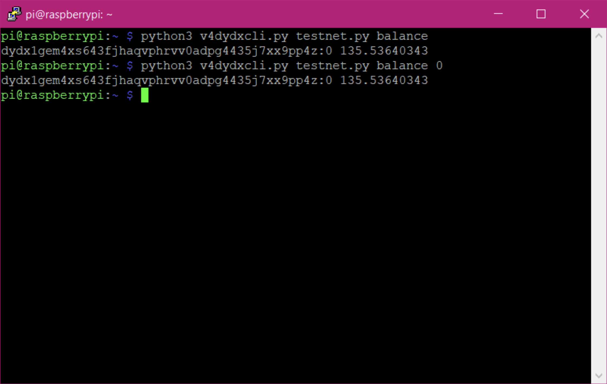

## Command: buyquantity
This command buys a specific amount of crypto using MARKET order.
- Parameters: Must specify the market and amount.
- Syntax

`python3 v4dydxcli.py <apikeyfile> buyquantity <market> <quantity>`

- Example

`python3 v4dydxcli.py testnet.py buyquantity BTC-USD 0.001`

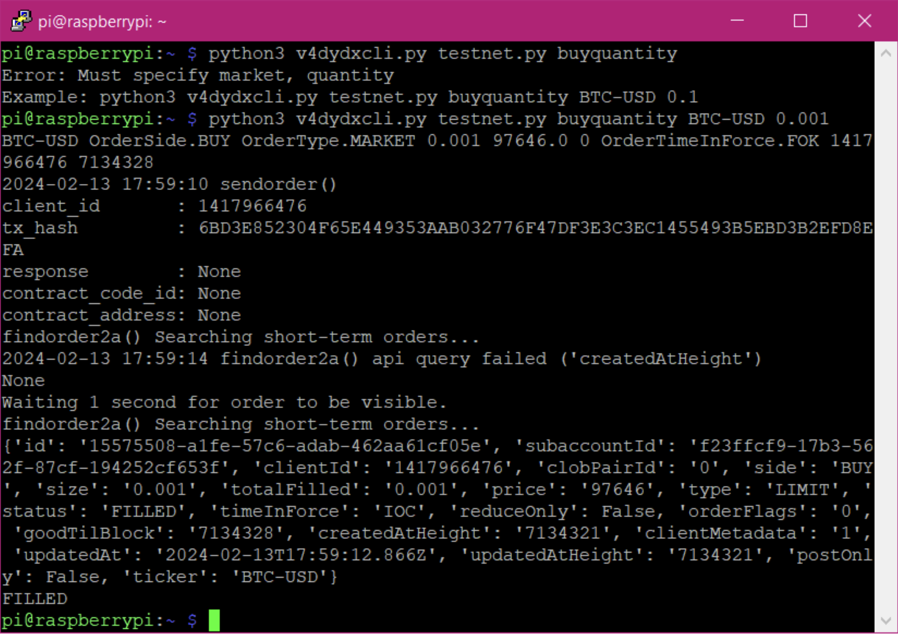

## Command: sellquantity
This command sells a specific amount of crypto using MARKET order.
- Parameters: Must specify the market and amount.
- Syntax

`python3 v4dydxcli.py <apikeyfile> sellquantity <market> <quantity>`

- Example

`python3 v4dydxcli.py testnet.py sellquantity ETH-USD 0.01`

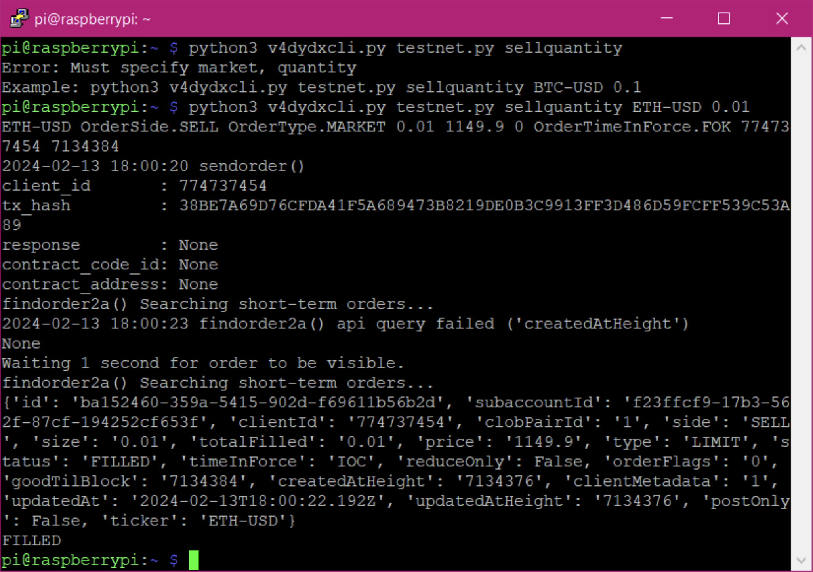

## Command: buyusdc
This command buys a specific USD-amount of crypto using MARKET order.
- Parameters: Must specify the market and USD-amount.
- Syntax

`python3 v4dydxcli.py <apikeyfile> buyusdc <market> <USD-amount>`

- Example

`python3 v4dydxcli.py testnet.py buyusdc SOL-USD 200`

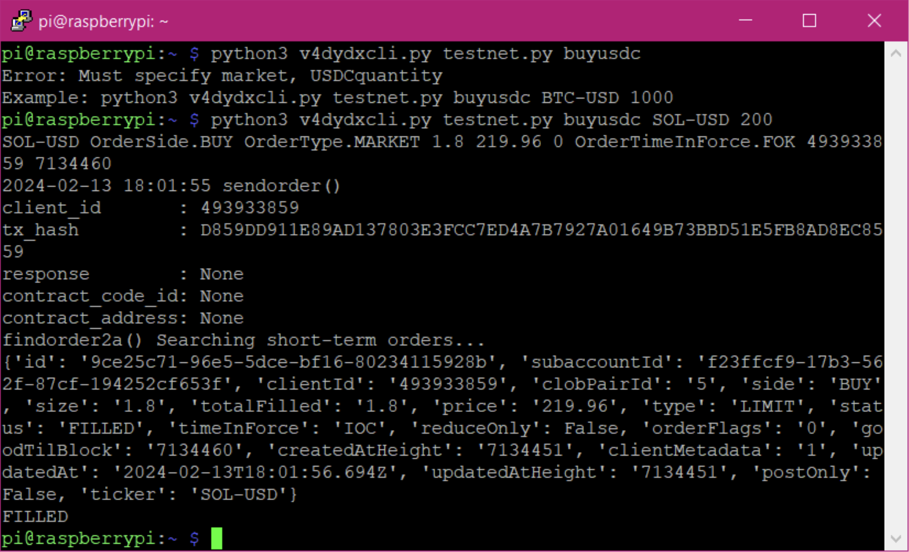

## Command: sellusdc
This command sells a specific USD-amount of crypto using MARKET order.
- Parameters: Must specify the market and USD-amount.
- Syntax

`python3 v4dydxcli.py <apikeyfile> sellusdc <market> <USD-amount>`

- Example

`python3 v4dydxcli.py testnet.py sellusdc LINK-USD 200`

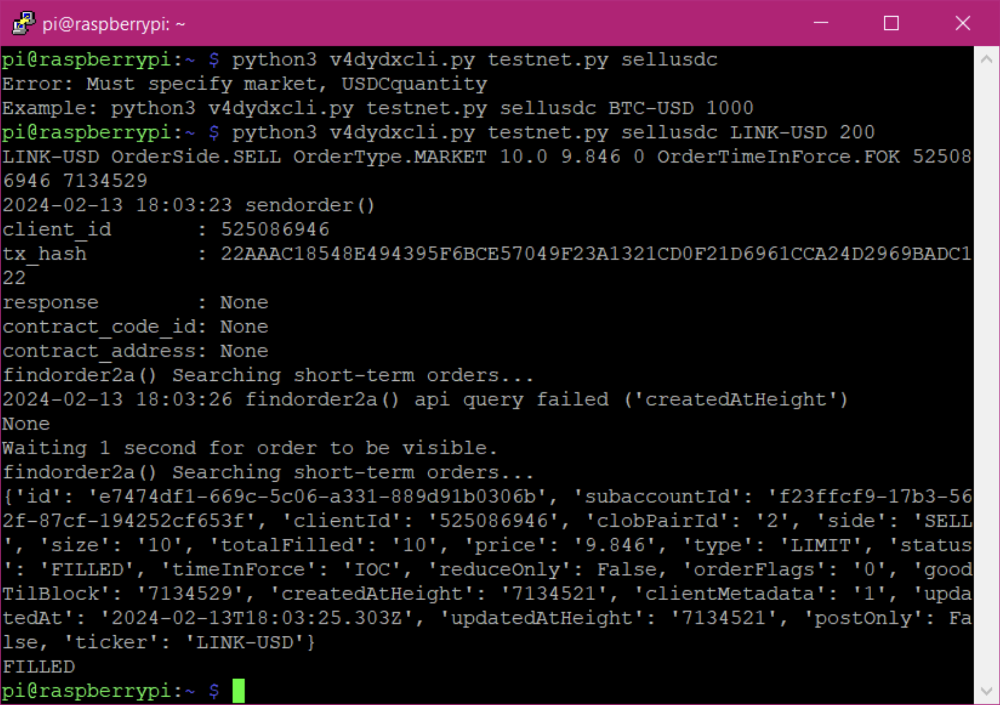

## Command: positions
This command shows open positions.  If no open positions, it returns nothing.  If you have been following the examples so far, we have opened 4 positions and this is displayed below.
- Parameters: None.
- Syntax

`python3 v4dydxcli.py <apikeyfile> positions`

- Example

`python3 v4dydxcli.py testnet.py positions`

## Command: buyquantitylimit
This command buys a specific amount of crypto using LIMIT order.
- Parameters: Must specify the market, quantity, limit-price, and expiration (in seconds).
- Syntax

`python3 v4dydxcli.py <apikeyfile> buyquantitylimit <market> <quantity> <limitprice> <expiration>`

- Example

`python3 v4dydxcli.py testnet.py buyquantitylimit BTC-USD 0.002 30000 3600`

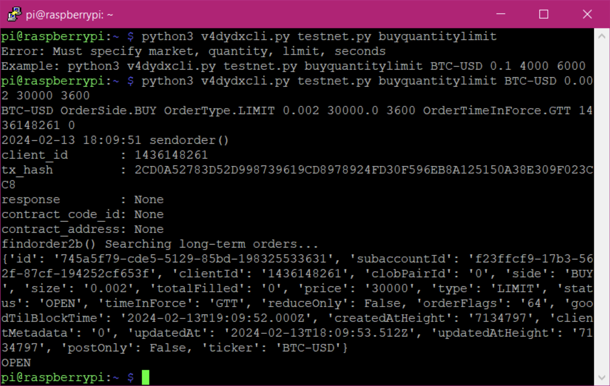

## Command: sellquantitylimit
This command sells a specific amount of crypto using LIMIT order.
- Parameters: Must specify the market, quantity, limit-price, and expiration (in seconds).

- Syntax

`python3 v4dydxcli.py <apikeyfile> sellquantitylimit <market> <quantity> <limitprice> <expiration>`

- Example

`python3 v4dydxcli.py testnet.py sellquantitylimit ETH-USD 0.02 4000 3600`

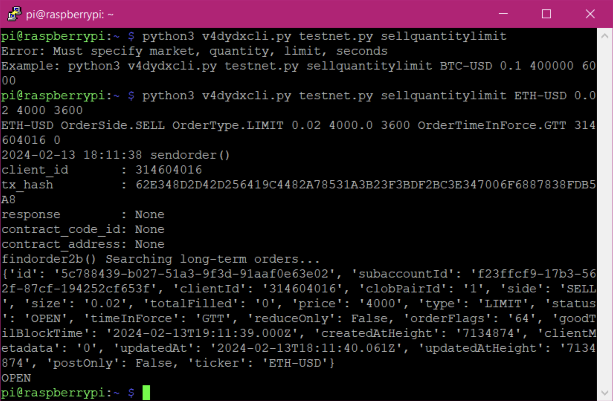

## Command: getorder
This command gets the data on an order with a specific client-id.  Alternatively, you can specify a status to find all orders with that status.
- Parameters: Must specify the client-id or a status.

- Syntax

`python3 v4dydxcli.py <apikeyfile> getorder <clientid or status>`

- Example

`python3 v4dydxcli.py testnet.py getorder 525086946

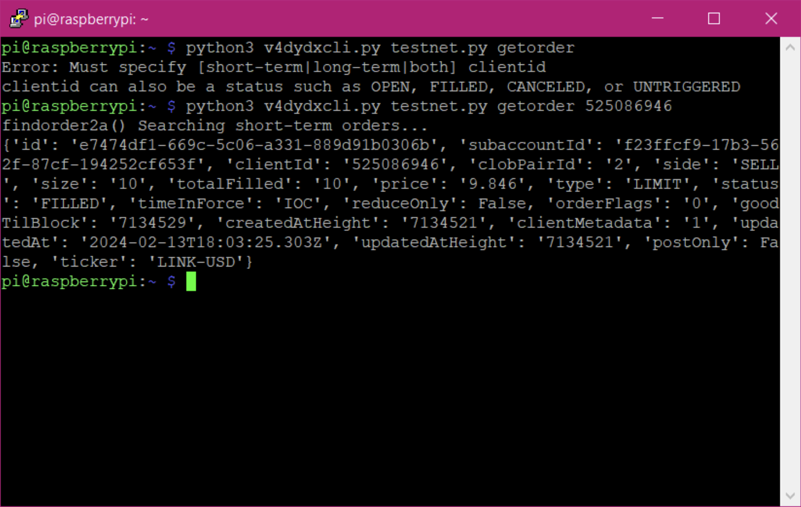

- Example

`python3 v4dydxcli.py testnet.py getorder OPEN`

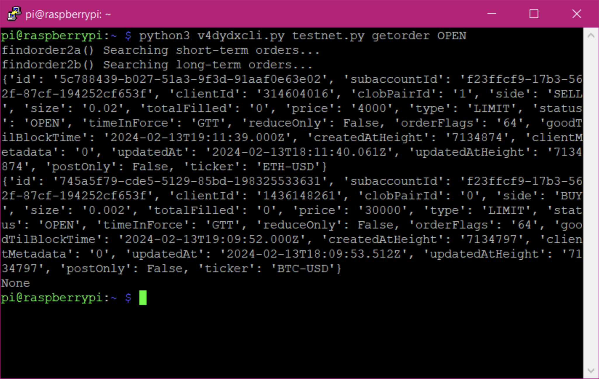

## Command: getorderid
This command gets the data on an order with a specific order-id.
- Parameters: Must specify the order-id.

- Syntax

`python3 v4dydxcli.py <apikeyfile> getorderid <orderid>`

- Example

`python3 v4dydxcli.py testnet.py getorderid e7474df1-669c-5c06-a331-889d91b0306b`

## Command: cancelorder
This command cancels an order with a specific client-id.  Alternatively, you can specify a status to cancel all orders with that status.
- Parameters: Must specify the client-id or a status.
- Syntax

`python3 v4dydxcli.py <apikeyfile> cancelorder <client-id or status>`

- Example

`python3 v4dydxcli.py testnet.py cancelorder 314604016`

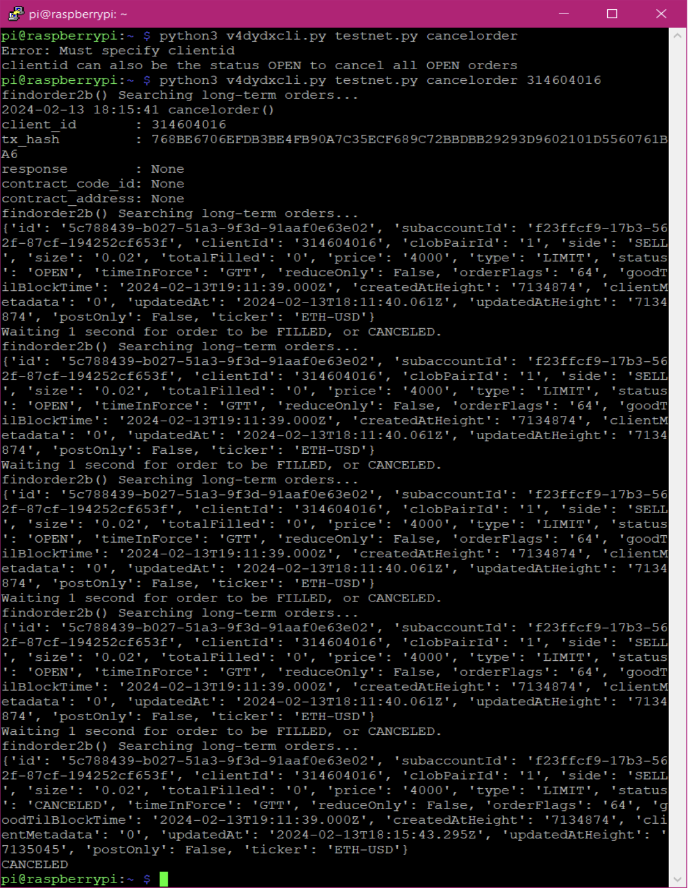

- Example

`python3 v4dydxcli.py testnet.py cancelorder OPEN`

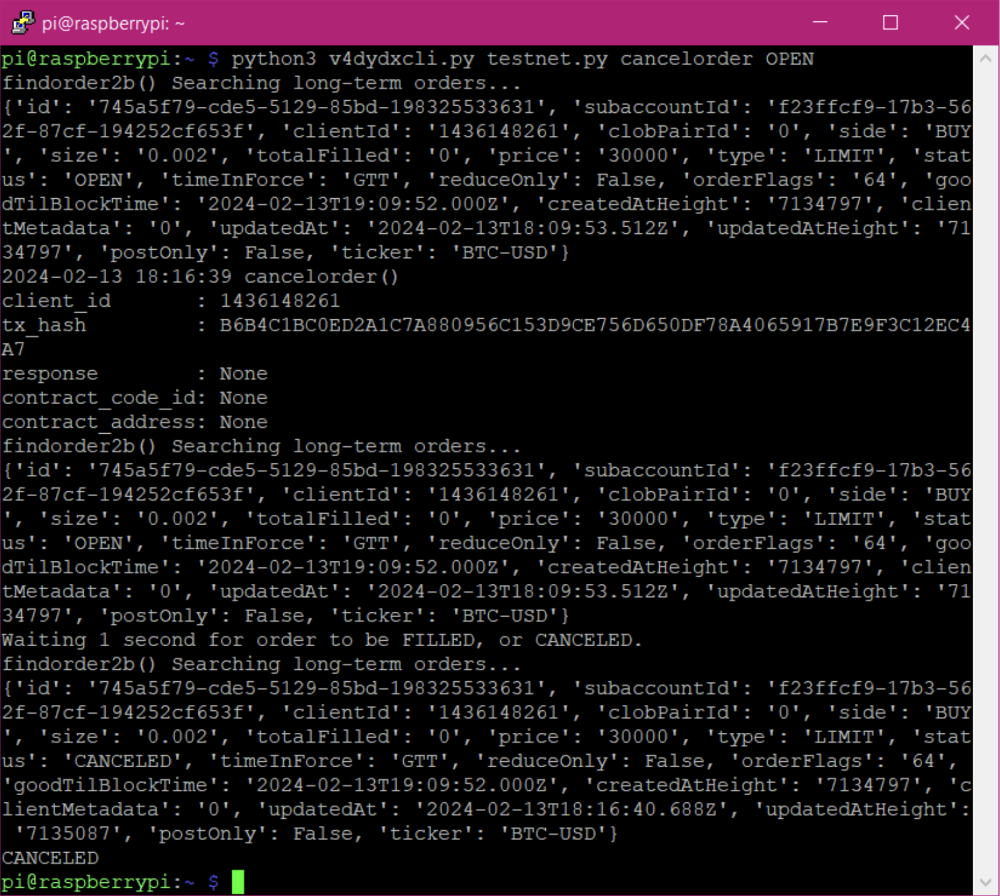
