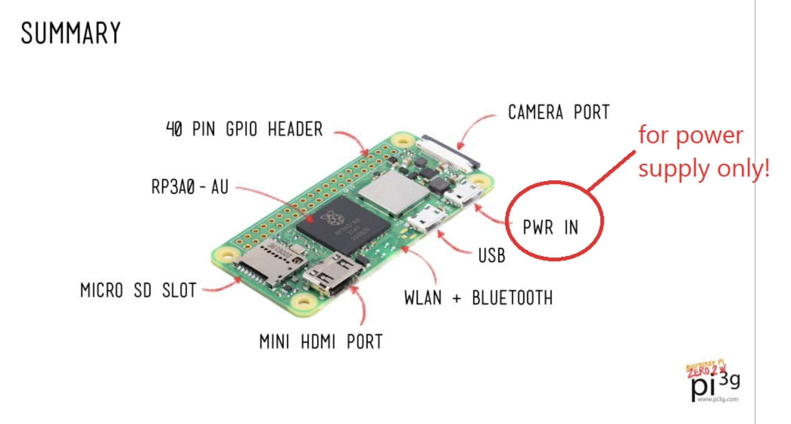
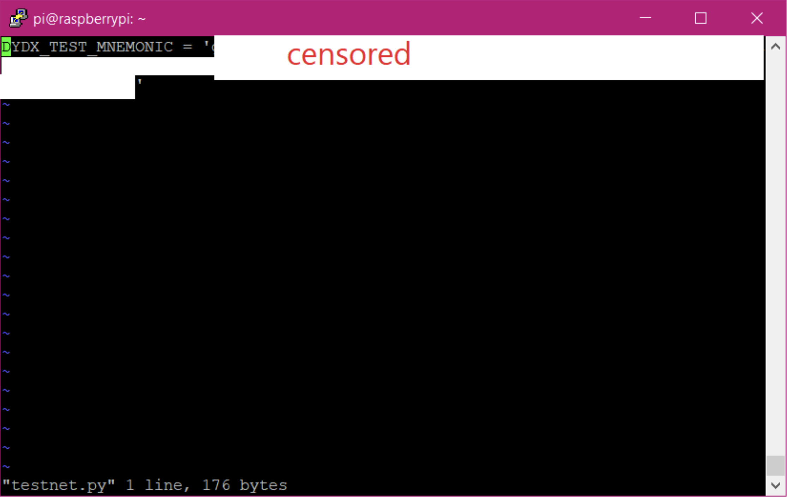
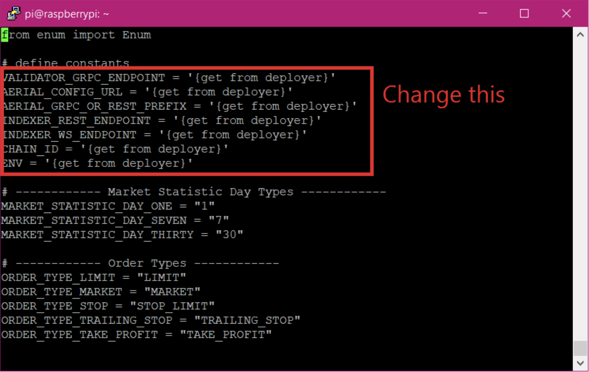
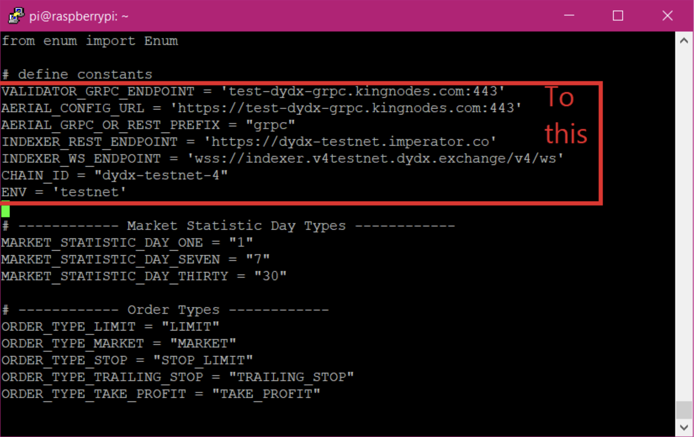
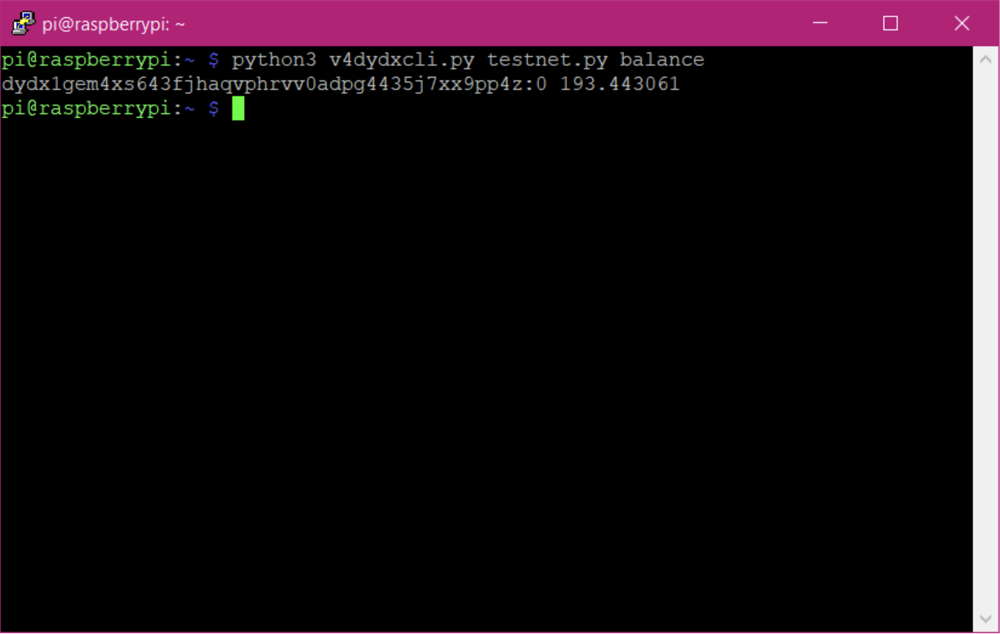

# Setting Up Raspberry Pi for API Trading

## Chapter 1: Initial Setup

1. Note that one of the micro-USB ports is for power only.  Do not plug your keyboard/mouse/hub in this port.  It won’t damage it but it won’t work.

2. After installation, enable SSH.  Instructions here: https://www.onlogic.com/company/io-hub/how-to-ssh-into-raspberry-pi/
3. Use Terminal for all commands below.
4. Get the IP address with this command:
`ip addr show`
5. Install the latest updates with:
`sudo apt-get update`
`sudo apt-get upgrade`
6. Add more swap memory: Instructions here, except use “CONF_SWAPSIZE=4096” (your microSD memory card should be 16GB or more)
https://web.archive.org/web/20220326020133/https://nebl.io/neblio-university/enabling-increasing-raspberry-pi-swap/
7. Reboot with:
`sudo shutdown -r 0`
8. For the next part, you will need to know how to use the ‘vi’ text editor.  Take the simple tutorial here:
https://www.redhat.com/sysadmin/introduction-vi-editor

## Chapter 2: Install Pre-requisites

1. Install dependencies.

`sudo apt-get install python3-pip`

`sudo apt-get install git`

`pip3 install v4-proto`

`pip3 install python-dateutil`

`pip3 install grpcio`

`pip3 install bip_utils`

`pip3 install bech32`

`pip3 install websockets`

`pip3 install websocket-client`

`git clone https://github.com/kaloureyes3/v4-clients`

`git clone https://github.com/chiwalfrm/dydxexamples`

`ln -s dydxexamples/dydxcli/v4dydxcli.py .
^(note that’s a lowercase L at the beginning, not an uppercase-eye and there is a period at the end of the command)

`chmod 755 dydxexamples/dydxcli/v4closeallpositions.sh`

2. Create a APIKEY file.  In this file, type the line `DYDX_TEST_MNEMONIC = '<your 24 word dydx seed on testnet-4>’`

`vi myapikeyfile.py`

3. Add testnet parameters to API client:

`vi ./v4-clients/v4-client-py/v4_client_py/clients/constants.py`

`VALIDATOR_GRPC_ENDPOINT = 'test-dydx-grpc.kingnodes.com:443'`

`AERIAL_CONFIG_URL = 'https://test-dydx-grpc.kingnodes.com:443'`

`AERIAL_GRPC_OR_REST_PREFIX = "grpc"`

`INDEXER_REST_ENDPOINT = 'https://dydx-testnet.imperator.co'`

`INDEXER_WS_ENDPOINT = 'wss://indexer.v4testnet.dydx.exchange/v4/ws'`

`CHAIN_ID = "dydx-testnet-4"`

`ENV = 'testnet'`

4. Test it out by checking your balance:

`python3 v4dydxcli.py myapikeyfile.py balance`

5. Note that you can get a list of commands by typing the following command.  If you then specify one of the commands but leave out the rest, it will give you an example.

`python3 v4dydxcli.py myapikeyfile.py help`

6. Now you are ready for the workshop.

## Chapter 3: Periodic Updates

Periodic updates are recommended in order to get the latest changes from developers.

1. Install the latest OS updates with:

`sudo apt-get update`

`sudo apt-get upgrade`

2. Update the dydx packages:

`pip3 install v4-proto -U`

`rm -rf v4-clients dydxexamples`

`git clone https://github.com/kaloureyes3/v4-clients`

`git clone https://github.com/chiwalfrm/dydxexamples`

3. Note that you have to repeat the Chapter 2 step ‘Add testnet parameters to API client’ above.

## Chapter 4: Trade on Mainnet (Deployment by dYdX Operations Services Ltd.)

1. Repeat the Chapter 2 step ‘Add testnet parameters to API client’ except with the following changes:

`VALIDATOR_GRPC_ENDPOINT = 'dydx-grpc.publicnode.com:443'`

`AERIAL_CONFIG_URL = 'https://dydx-grpc.publicnode.com:443'`

`AERIAL_GRPC_OR_REST_PREFIX = "grpc"`

`INDEXER_REST_ENDPOINT = "https://indexer.dydx.trade/"`

`INDEXER_WS_ENDPOINT = "wss://indexer.dydx.trade/v4/ws"`

`CHAIN_ID = "dydx-mainnet-1"`

`ENV = 'mainnet'`

