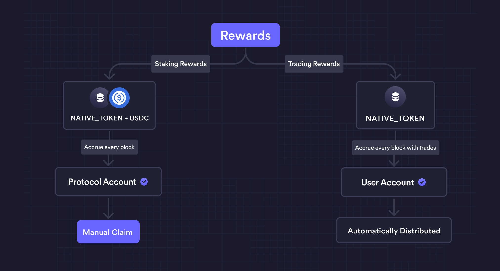

# Overview

There are several reward mechanisms available with the protocol software.

|                 | Target Users         | Rewards paid in     | Claim Process | Frequency               |
| --------------- | -------------------- | ------------------- | ------------- | ----------------------- |
| Staking Rewards | Validators & Stakers | USDC & NATIVE_TOKEN | Manual        | Per Block               |
| Trading Rewards | Traders              | NATIVE_TOKEN        | Automatic     | Per Block (with trades) |

## Staking Rewards

- Rewards distributed to `Validators` and `Stakers` (= Delegators)
- `Staking Rewards = Trading Fees + Gas Fees - Community Tax - Validator Commission`
- Distributed automatically every block
- Must be claimed manually

## Trading Rewards

- Rewards distributed to `Traders` after each successful trade
- Based on a specified `formula` with several inputs
- Distributed automatically every block with successful trades
- Claimed automatically
