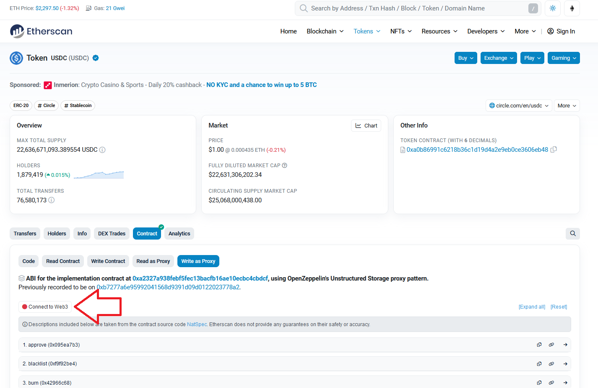
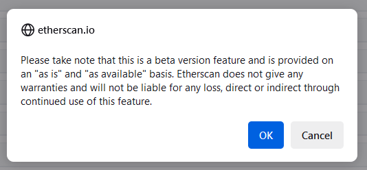
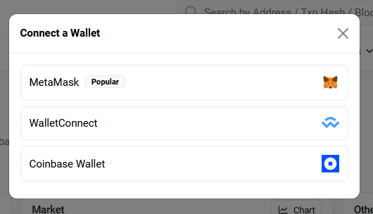
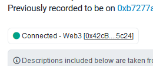
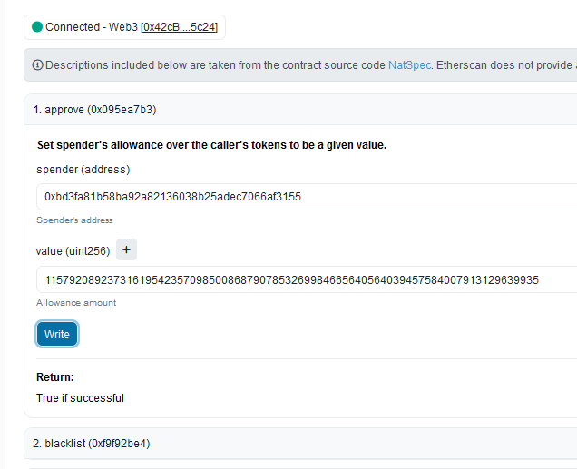
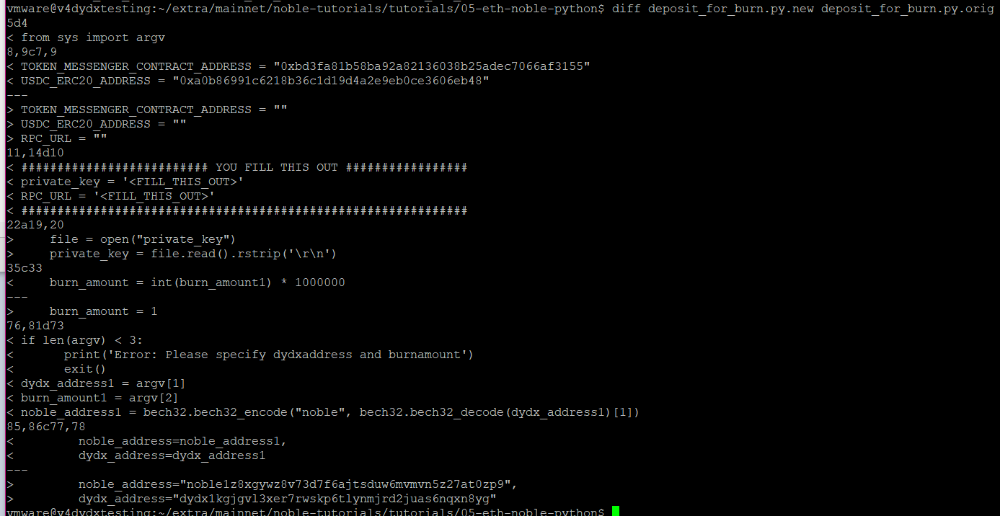

# How to send USDC from Ethereum to dYdX Chain

***By using, recording, referencing, or downloading (i.e., any “action”) any information contained on this page or in any dYdX Operations Services Ltd. ("dYdX Operations subDAO") database, you hereby and thereby agree to the [dYdX Chain Docs Terms of Use](../terms_and_policies/terms_of_use) governing such information, and you agree that such action establishes a binding agreement between you and dYdX Operations subDAO.***

## Requirements
1. This document refers to Mainnet.
2. Your wallet is on the Ethereum network.
3. You have sufficient ETH for gas and USDC.

## Prerequisite USDC Approval
1. First, go to [https://etherscan.io/token/0xa0b86991c6218b36c1d19d4a2e9eb0ce3606eb48#writeProxyContract](https://etherscan.io/token/0xa0b86991c6218b36c1d19d4a2e9eb0ce3606eb48#writeProxyContract)
2. Click the “Connect to Web3” button



3. Now it turns green.

4. Click on the first line `1. Approve (0x095ea7b3)` to expand it, input `0xbd3fa81b58ba92a82136038b25adec7066af3155` in the spender (address) box and `115792089237316195423570985008687907853269984665640564039457584007913129639935` in the second box (value (`uint256`)) for unlimited. You can specify a smaller number here as well.

5. Click the `Write` button.

## Procedure
1. Starting with code provided here: [https://github.com/bd21/noble-tutorials/tree/master/tutorials/05-eth-noble-python](https://github.com/bd21/noble-tutorials/tree/master/tutorials/05-eth-noble-python), a few changes have been made to allow you to specify: `(1) a dYdX Chain address`, and `(2) the USDC amount`. Here is a diff showing the differences:

2. Save the source code (last section of this document) as `deposit_for_burn.py`, create a directory called `abi/`, and download `TokenMessengerWithMetadata.json` from the `abi/` directory at github above, and save it into `abi/`. You now have the following files in the working directory.
```bash
./deposit_for_burn.py
./abi/TokenMessengerWithMetadata.json
```
3. Run the program like this: 
```bash
python3 deposit_for_burn.py <dydxaddress> <burnamount>
```
where `<dydxaddress>` is your dYdX-Chain address and `<burnamount>` is the amount of USDC. For example:
```bash
python3 deposit_for_burn.py dydx1gem4xs643fjhaqvphrvv0adpg4435j7xx9pp4z 100
```
4. Be patient. It may take up to 30 minutes to see the funds show up on the Noble blockchain. After that you can connect your wallet to v4 and it will sweep the funds from Noble into v4.

## Source Code
```python
import hexbytes
from web3 import Web3
import bech32
from pprint import pprint
from sys import argv


TOKEN_MESSENGER_CONTRACT_ADDRESS = "0xbd3fa81b58ba92a82136038b25adec7066af3155"
USDC_ERC20_ADDRESS = "0xa0b86991c6218b36c1d19d4a2e9eb0ce3606eb48"

########################## YOU FILL THIS OUT #################
private_key = '<FILL_THIS_OUT>'
RPC_URL = '<FILL_THIS_OUT>'
##############################################################

# requires a local file named 'private_key' with a hex encoded eth private key (no 0x prefix)
def deposit_for_burn(noble_address, dydx_address):
    # initialize client
    web3 = Web3(Web3.HTTPProvider(RPC_URL))
    assert web3.is_connected()

    # initialize account, smart contract
    account = web3.eth.account.from_key(private_key)
    file = open("abi/TokenMessenger.json")
    abi = file.read()

    contract_address = str(web3.to_checksum_address(TOKEN_MESSENGER_CONTRACT_ADDRESS))
    contract = web3.eth.contract(address=contract_address, abi=abi)

    print("Building Ethereum depositForBurn txn...")

    mint_recipient = convert(noble_address)  # intermediate noble minting address
    print("Derived Noble address: " + noble_address)

    burn_amount = int(burn_amount1) * 1000000
    usdc_address = str(Web3.to_checksum_address(USDC_ERC20_ADDRESS))

    print("Broadcasting...")

    call_function = contract.functions.depositForBurn(
        burn_amount,
        4,  # noble
        mint_recipient,
        usdc_address
    ).build_transaction({
        "chainId": web3.eth.chain_id,
        "from": account.address,
        "nonce": web3.eth.get_transaction_count(account.address),
    })
    signed_tx = web3.eth.account.sign_transaction(call_function, private_key=private_key)

    # Send the raw transaction:
    tx_hash = web3.eth.send_raw_transaction(signed_tx.rawTransaction)
    tx_receipt = web3.eth.wait_for_transaction_receipt(tx_hash)
    # print("eth tx hash: https://etherscan.io/tx/" + tx_hash.hex())
    print("eth tx hash: https://goerli.etherscan.io/tx/" + tx_hash.hex())
    print("eth tx receipt: ")
    pprint(tx_receipt)

    # print("Minting to https://testnet.mintscan.io/noble-testnet/account/" + noble_address)
    print("Minting to https://mintscan.io/noble/account/" + noble_address)


# Convert bech32 address to a format suited for CCTP
def convert(address) -> hexbytes.HexBytes:
    result = bytearray(32)
    decoded = bech32.convertbits(
        data=bech32.bech32_decode(address)[1],
        frombits=5,
        tobits=8,
        pad=False
    )
    result[32 - len(decoded):] = decoded
    return hexbytes.HexBytes(result)

if len(argv) < 3:
        print('Error: Please specify dydxaddress and burnamount')
        exit()
dydx_address1 = argv[1]
burn_amount1 = argv[2]
noble_address1 = bech32.bech32_encode("noble", bech32.bech32_decode(dydx_address1)[1])

if __name__ == "__main__":
    deposit_for_burn(
        noble_address=noble_address1,
        dydx_address=dydx_address1
    )
    # alternatively, you can derive the noble address
    # deposit_for_burn(
    #     dydx_address="dydx1kgjgvl3xer7rwskp6tlynmjrd2juas6nqxn8yg",
    #     noble_address=bech32.bech32_encode("noble", bech32.bech32_decode("dydx1kgjgvl3xer7rwskp6tlynmjrd2juas6nqxn8yg")[1]),
    # )
```