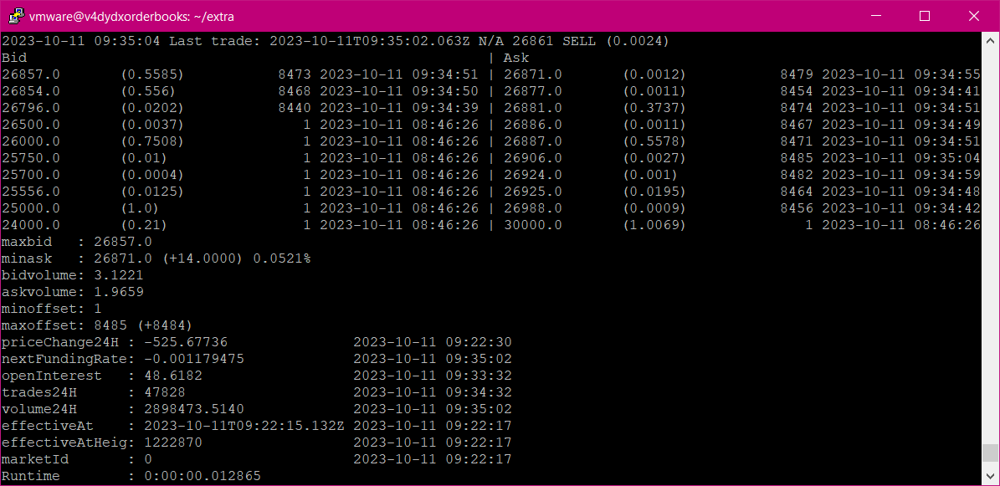
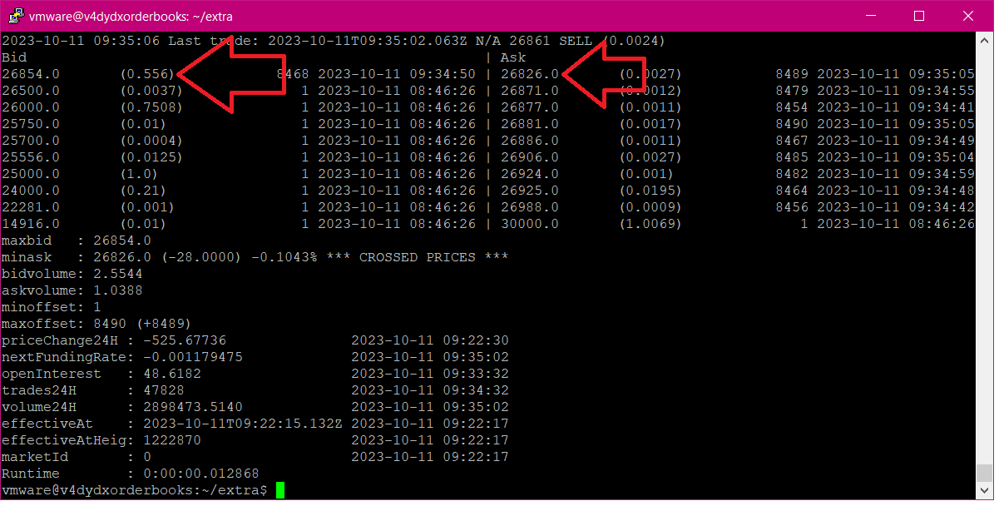
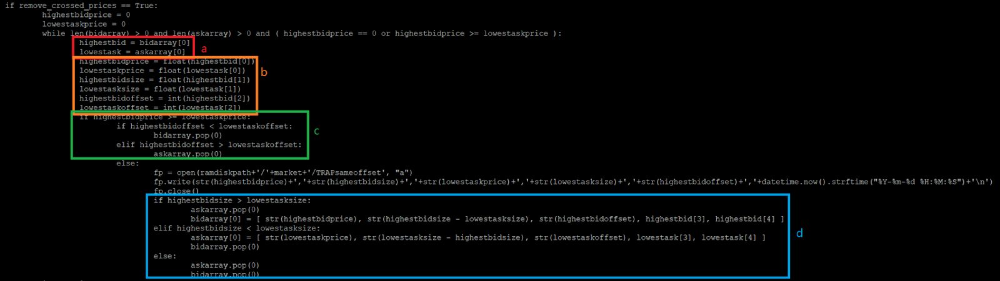

# How to uncross the orderbook

***By using, recording, referencing, or downloading (i.e., any “action”) any information contained on this page or in any dYdX Operations Services Ltd. ("dYdX Operations subDAO") database, you hereby and thereby agree to the [dYdX Chain Docs Terms of Use](../terms_and_policies/terms_of_use) governing such information, and you agree that such action establishes a binding agreement between you and dYdX Operations subDAO.***

## Observation
First, let’s take a look at an actual example of a crossed orderbook for BTC-USD on v4 Testnet.

At the moment just before it crossed, the below is what is shown. There are no crossed prices here:


At the next update, the below is what is shown and there was a crossed price:


As shown above, the best bid was 26854 and the best ask was 26826, which is lower than the best bid.

## Explanation

v4 doesn't guarantee that order book prices don't cross because there is no centralized order book. For that reason, the software does not include a global offset. The “correct” order book at any given time is whatever the current block proposer has in its mempool, which is not what the indexer or the front end can directly see. The block proposer changes every block, so there is a new canonical mempool, and therefore, a new canonical order book every block. Due to the particulars of message propagation, that means there will be slight differences in the canonical order book every block. If the trader doesn’t need the order book prices uncrossed, simply listen to the updates given by the websocket and they should uncross eventually.

## How to uncross
If trader needs the order book uncrossed, then one way is to use the order of messages as a logical timestamp. That is, when a message is received, update a global locally-held offset. Each websocket update has a message-id which is a logical offset to use.

```python
if remove_crossed_prices == True:
                highestbidprice = 0
                lowestaskprice = 0
                while len(bidarray) > 0 and len(askarray) > 0 and ( highestbidprice == 0 or highestbidprice >= lowestaskprice ):
                        highestbid = bidarray[0]
                        lowestask = askarray[0]
                        highestbidprice = float(highestbid[0])
                        lowestaskprice = float(lowestask[0])
                        highestbidsize = float(highestbid[1])
                        lowestasksize = float(lowestask[1])
                        highestbidoffset = int(highestbid[2])
                        lowestaskoffset = int(lowestask[2])
                        if highestbidprice >= lowestaskprice:
                                if highestbidoffset < lowestaskoffset:
                                        bidarray.pop(0)
                                elif highestbidoffset > lowestaskoffset:
                                        askarray.pop(0)
                                else:
                                        fp = open(ramdiskpath+'/'+market+'/TRAPsameoffset', "a")
                                        fp.write(str(highestbidprice)+','+str(highestbidsize)+','+str(lowestaskprice)+','+str(lowestasksize)+','+str(highestbidoffset)+','+datetime.now().strftime("%Y-%m-%d %H:%M:%S")+'\n')
                                        fp.close()
                                        if highestbidsize > lowestasksize:
                                                askarray.pop(0)
                                                bidarray[0] = [ str(highestbidprice), str(highestbidsize - lowestasksize), str(highestbidoffset), highestbid[3], highestbid[4] ]
                                        elif highestbidsize < lowestasksize:
                                                askarray[0] = [ str(lowestaskprice), str(lowestasksize - highestbidsize), str(lowestaskoffset), lowestask[3], lowestask[4] ]
                                                bidarray.pop(0)
                                        else:
                                                askarray.pop(0)
                                                bidarray.pop(0)

```

v4 software stores the message-id for each bid/ask as the third element of a list, for example: `['26854.0', '0.556', '8468']` would be the best bid for the example above (`bidarray[0]`).  From left to right, the elements are price, size, and message-id.  And `['26826.0', '0.0027', '8489']` would be the corresponding best ask (`askarray[0]`).  (see box a in the graphic below)

Next, set the following variables in the first iteration of the while loop (see box b in the graphic below).
```
    highestbid =  ['26854.0', '0.556', '8468']
    lowestask = ['26826.0', '0.0027', '8489']
    highestbidprice = 26854
    lowestaskprice = 26826
    highestbidsize = 0.556
    lowestasksize = 0.0027
    highestbidoffset = 8468
    lowestaskoffset = 8489
```

Then, compare the two sides, using the offsets to determine whether to discard the bid or ask (see box c in the graphic below), or in the case where both bid/ask have the same offset, it compares the volume on each side (see box d in the graphic below).

