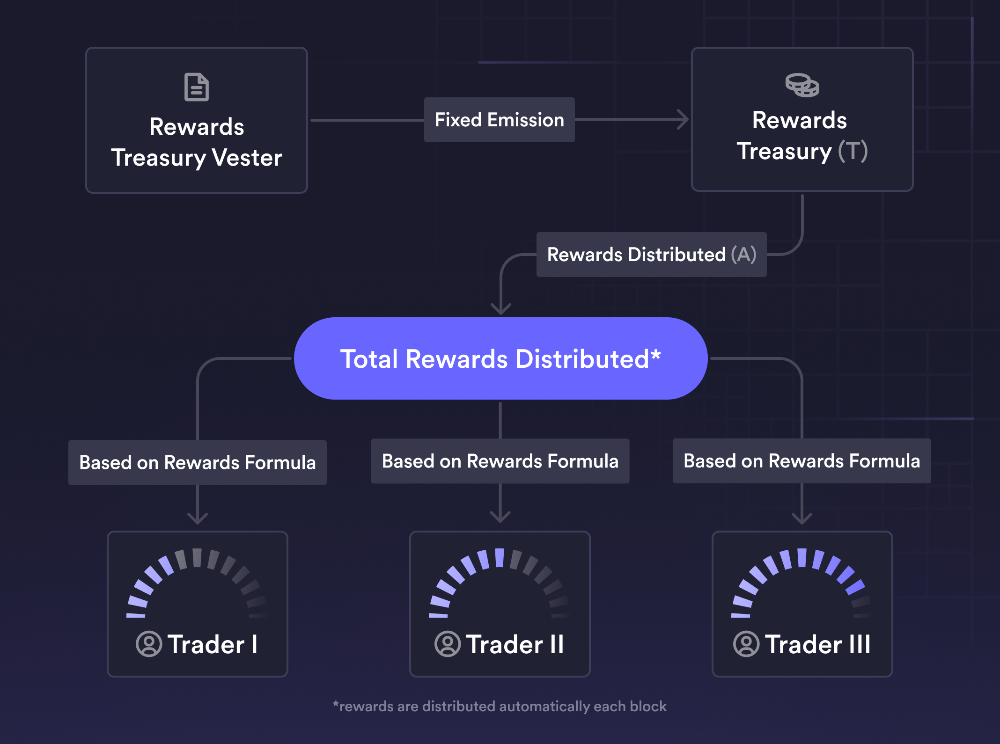
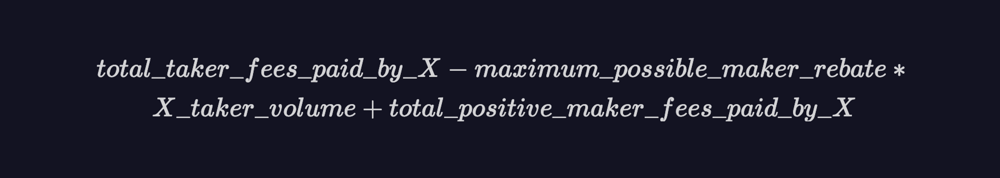
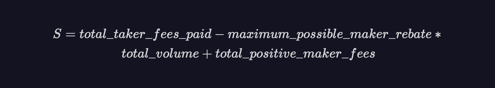

# Trading Rewards

Trading rewards are designed to incentivize Traders to trade on the protocol. The source of trading rewards is a configured Rewards Treasury account.

For each successful trade, Traders will be rewarded in `NATIVE_TOKEN` based on the formula outlined in the below section. Trading rewards are distributed automatically and directly to the trader’s account per block. 

## Motivation

The primary goal behind trading rewards is to incentivize trading on the protocol.

To facilitate fair trading behaviors and to preserve the protocol’s safety, trading rewards have the following secondary goals:

- Self-trading should not be profitable
- Any distributed rewards should be proportional to fees paid to the protocol
- Trading rewards should be deterministic
- Trading rewards should be settled and distributed every block
- Trading rewards should limit the protocol overspending on trading activity

## Details

### Reward Treasury

The amount of tokens available to be distributed to traders is tracked by the protocol’s configured Rewards Treasury account. Call the size of this Rewards Treasury `T`. 

Each block, new tokens are transferred into this `T` from the vesting account and rewards are then distributed from `T`. 

Each block, `T` can grow or shrink based on protocol activity.

### Reward Treasury Vesting

The protocol’s default vesting behavior is to linearly vest `denom` tokens from `vester_account` to `treasury_account` from `start_time` to `end_time`.

The above is configured via `VestEntry`.

### Formula & Emission

Let `A` represent the amount of rewards that are distributed from this `T` to traders in a given block.

We define a trader X’s `rewards score` in a given block as:

Let `S` be the sum of all the rewards scores across all traders for a given block. `S` is given by:

Every block, the amount `A` of the native token that is distributed to traders is defined as:

Where `C` is a constant configurable via governance.

The amount remaining `(T - A)` is retained in the Rewards Treasury and new tokens are emitted into the Rewards Treasury the following block.

`A` is calculated and distributed to all the takers who traded in the block and `(T - A)` is rolled over and retained in the Rewards Treasury for the next block.

The rewards distributed, `A`, are allocated proportional to each trader’s score.

## FAQ

****How do trading rewards affect potential inflation of the governance token?****

Trading rewards distributed by the protocol, each block, are capped at the dollar equivalent of the total net trading fees generated by the protocol that block. Thus, trading rewards distributed can fluctuate on a block by block basis.

This can result in a large amount of “savings” by the protocol (via reduced inflation) by not overspending to incentivize trading activity.

## Parameters / Configurations

> 💡 The current configuration and parameters can be found by querying the network.

### Rewards

- `treasury_account`: referred to as `T` in the above. specifies which account the trading rewards come from. Can be configured via gov.
- `denom`: specifies the token that the trading rewards should use. Can be configured via gov.
- `fee_multiplier_ppm`: referred to as `C` in the above. Specifies the proportion (in ppm) that fees should be multiplied by to get the maximum rewards amount. Can be configured via gov.

### Vest

- `VestEntry` : specifies a vesting schedule from `vester_account` to `treasury_account` for a given `denom` token. The vesting happens linearly from `start_time` and `end_time`.
