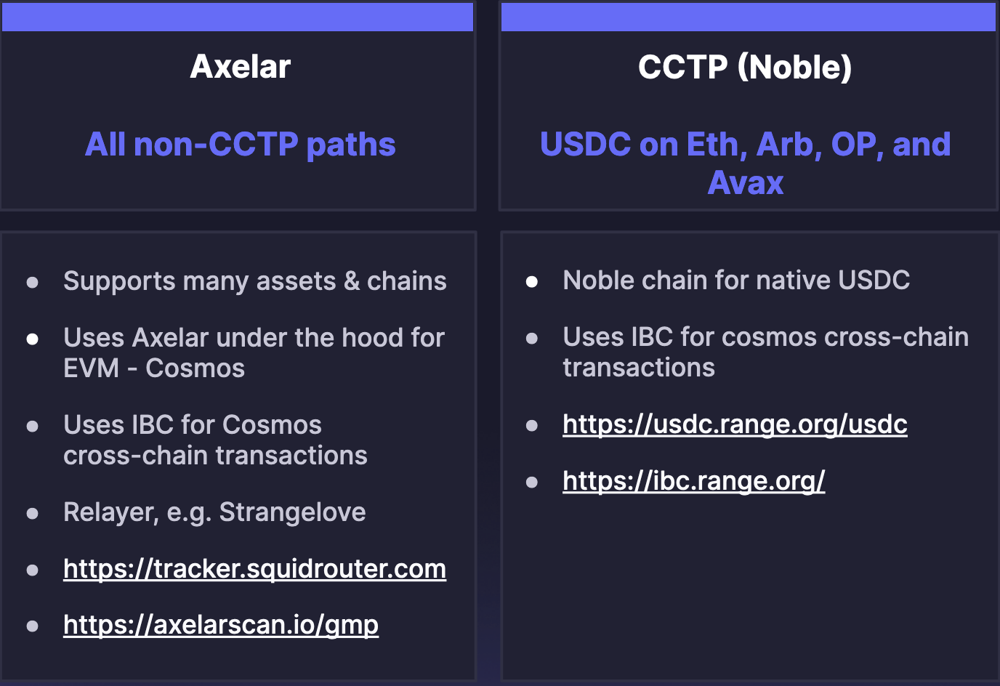
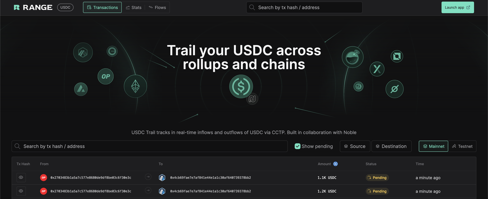
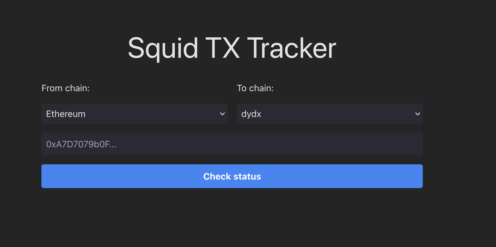

# Troubleshooting withdrawals and deposits on dYdX Chain

If you have initiated a deposit or withdrawal from dYdX v4 and your funds haven't arrived within an hour, follow this guide to better understand where your transaction is in the process and how to troubleshoot it.

> **Important:**: After submitting a deposit, make sure you do not close the tab or web browser, as leaving the website will lead to funds getting delayed en route to your dYdX address.

## Withdrawal and Deposit Process

There are 2 main withdrawal and deposit flows on the dYdX front end.
We can categorize them in:

1. **CCTP**: USDC deposits or withdrawals via Etherium, Arbitrum, Optimism and Avalanche.
2. **Axelar** or non-CCTP: If they do not fall into the CCTP category, they are by default using the Axelar route. This includes USDC transfers on non-CCTP supported chains, and all other assets from other chains.

## Troubleshooting CCTP Transactions

### CCTP Flow

If your deposit is routed via CCTP, the process is as follows:

1. Native USDC is burned on the source chain
2. The same amount of USDC is minted on Noble chain
3. USDC is routed to dYdX Chain via IBC

Withdrawals follow the opposite flow, with Noble USDC being burned on Noble chain and Native USDC being minted on the destination chain.
For more info on this flow, see: [https://dydx.exchange/blog/cctp](https://dydx.exchange/blog/cctp).

### CCTP deposits troubleshooting

1.  **Check dYdX Frontend status**

    Refresh your browser and check on the dYdX front end if your deposit has succeeded.
    If you notice after **one hour** that your deposit is still on the "bridging tokens" step, continue to step 2.
    ​

2.  **Check tracker tool**

    Check whether your USDC has been bridged, by entering the transaction hash on [https://usdc.range.org/usdc](https://usdc.range.org/usdc).

    > **Tip**: Be sure to tick the "Show Pending" box.

    ​

      

    1. If the status shows "finalized", USDC should have arrived on Noble, and you can move on to step 3.

    2. If the status shows "Pending" for more than one hour, raise a support ticket to _[https://dydx.trade](https://dydx.trade) > Help > Live Chat_ and make sure to share:
       - Transaction hash
       - EVM address
       - dYdX address

3.  **Check destination address**

    Now check whether your funds have arrived on dYdX: [https://www.mintscan.io/dydx](https://www.mintscan.io/dydx).
    You should see a "deposit to subaccount" transaction there.

    - If not, you can confirm whether USDC has arrived on Noble, by checking [https://www.mintscan.io/noble](https://www.mintscan.io/noble) or [https://ibc.range.org](https://ibc.range.org).
    - You need to make sure you have the dYdX front end opened and wallet connected. The dYdX front end will detect your funds on Noble and auto-sweep it to your dYdX address. For this to happen, you need to actively open the front end and connect your wallet.
      ​

4.  **Manual process stuck funds**

    If for some reason, you have done step 3, but you still don't see your funds on dYdX, you can always manually IBC transfer your funds to your dYdX address, by importing your secret phrase into Keplr and performing a manual IBC transaction from Noble to your dYdX address.

## Troubleshooting Axelar transactions

### Axelar Flow

If your deposit is routed via Axelar, the process is as follows:

1. Squid routes funds to axlUSDC on EVM using Axelar General Message Passing (GMP)
2. axlUSDC on EVM gets burned and axlUSDC minted on Axelar
3. axlUSDC is sent to Osmosis and swapped to Noble USDC
4. Bridge Noble USDC from Osmosis -> Noble chain -> dYdX Chain

Withdrawals follow the opposite flow.
For more info on this flow, see [https://dydx.exchange/blog/1-click-onboarding](https://dydx.exchange/blog/1-click-onboarding).

### Axelar troubleshooting

1. **Check dYdX Frontend status**

   Refresh your browser and check on the dYdX front end if your deposit has succeeded. If you notice after one hour that your deposit is still on the "bridging tokens" step, continue to step 2.
   ​

2. **Check tracker tool**

   Check whether your funds have arrived on the destination side, by entering the transaction hash on [https://tracker.squidrouter.com/](https://tracker.squidrouter.com/).

   ​

   **For Deposits**

   1. If the status shows "Succeeded", funds should have arrived on dYdX and you can move on to step 3.

   2. If the status shows "Ongoing" for more than one hour, check at which "hop" the funds got stuck.
      ​

      - If the funds are stuck on Osmosis or Noble, move on to step 3, to manually troubleshoot where your funds are.

      - If the funds are stuck on Axelar, raise a support ticket via:
        _[https://dydx.trade](https://dydx.trade) > Help > Live Chat_ and make sure to share:
        ​
        - Transaction hash
        - EVM address
        - dYdX address

   **For Withdrawals**

   1. If the status shows "Succeeded", funds should have arrived on your destination address and you can move on to step 3.

   2. If the status shows "Ongoing" for more than one hour, check at which hop the funds got stuck.
      ​ - If the funds are stuck on Axelar or Osmosis, raise a support ticket via
      _[https://dydx.trade](https://dydx.trade) > Help > Live Chat_ and make sure to share
      ​ - Transaction hash - EVM address - dYdX address

3. **Check destination**

   Now check whether your funds have arrived on the destination address.
   For deposits [https://www.mintscan.io/dydx](https://www.mintscan.io/dydx), you should see a "deposit to subaccount" transaction in your transactions.
   ​

   - If not, you can confirm whether the USDC has arrived on Noble, by checking [https://www.mintscan.io/noble](https://www.mintscan.io/noble).

   - You need to make sure you have the dYdX front end opened and your wallet connected. The dYdX front end will detect your funds on Noble and auto-sweep it to your dYdX address. For this to happen, you need to actively open the front end and connect your wallet.
     ​

4. **Manual process stuck funds**

   If for some reason, you have done step 3, but you still don't see the funds, you can always manually IBC transfer your funds to your dYdX address, by importing your secret phrase into Keplr and and perform a manual IBC transaction to your dYdX address.
