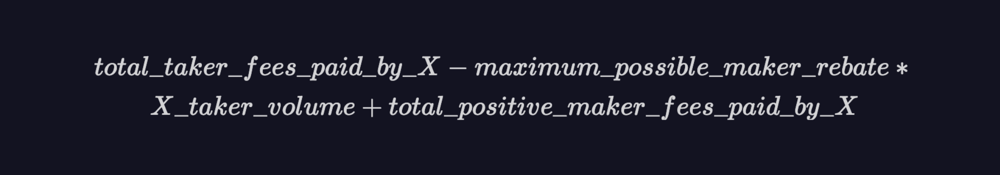
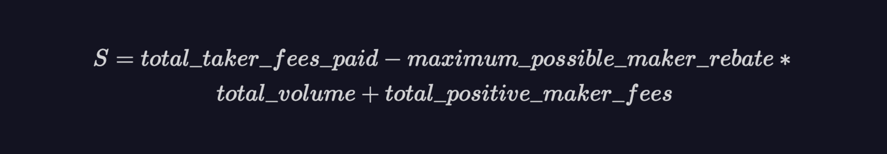
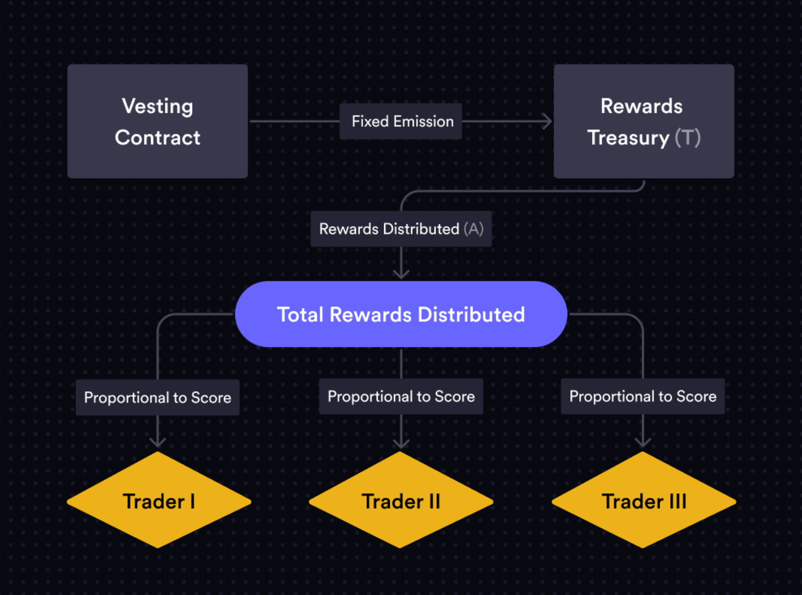

## Rewards, Fees and Parameters

### Trading Rewards
_Trading rewards are subject to adjustments by the applicable Governance Community._

The software will allow the network to fund and utilize trading rewards. 

In addition to incentivizing trading on the protocol, the general goals of trading rewards include: 

1. Self-trading should not be profitable 
2. Any distributed rewards should be proportional to fees paid to the protocol
3. Trading rewards should be deterministic
4. Trading rewards should be settled and distributed every block 
5. Trading rewards should limit the protocol overspending on trading activity

#### How do trading rewards work from a user perspective? 

Traders are rewarded after each successful trade made on the protocol.

Immediately after each fill, a user is sent a certain amount of trading rewards directly to their dYdX Chain address, based on the formulas described below. Prior to each trade, the UI also shows the maximum amount of rewards a trade of that size could receive.

Users earn trading rewards up to, but not exceeding, 90% of a fill’s net-trading-fees, paid in the governance token of the network.

#### How do trading rewards affect potential inflation of the governance token? 

Trading rewards distributed by the protocol, each block, are capped at the dollar equivalent of the total net trading fees generated by the protocol that block. Thus, trading rewards distributed can fluctuate on a block by block basis. 

This can result in a large amount of “savings” by the protocol (via reduced inflation) by not overspending to incentivize trading activity.

#### What formula for trading rewards will exist within the open source software? 

The software reflects a Rewards Treasury of tokens that are available to be distributed to traders. Call the size of this Rewards Treasury T. Each block, new tokens are transferred into this T from the vesting contract and rewards are then distributed. Each block, T can grow or shrink based on protocol activity. 

Let A represent the amount of rewards that are distributed from this T to traders in a given block.

We define a trader X’s “rewards score” in a given block as:

Let S be the sum of all the rewards scores across all traders for a given block. S is given by:

Every block, the amount A of the native token that is distributed to traders is defined as:

Where C is a constant configurable by the applicable Governance Community. The open source software is configured for the constant to be initially set at 0. 

The amount remaining (T - A) is retained in the Rewards Treasury and new tokens are emitted into the Rewards Treasury the following block.

A is calculated and distributed to all the takers who traded in the block and T - A is rolled over and retained in the Rewards Treasury for the next block.

The rewards distributed, A, are allocated proportional to each trader’s score. 

Once the Vesting Contract is funded, trading rewards will continue to run and settle automatically, every block.   

See below for a visual that summarizes trading rewards architecture.

### Fee Schedule
_The fee schedule is subject to adjustments by the applicable Governance Community_

The basic structure for fees have been developed to reflect the following characteristics:

1. Fees differ based on side (maker/taker)
2. Users are eligible for lower fees based on their 30 day trading volume across sub accounts and markets
3. Fees are uniform across all markets

| Tier  | 30d Trailing Volume                     | Taker (bps) | Maker (bps) |
|-------|-----------------------------------------|-----------------|----------------------------------------|
| 1     | < $1M                                  | 5.0             | 1.0                                    |
| 2    | ≥ $1M                                  | 4.5             | 1.0                                    |
| 3   | ≥ $5M                                  | 4.0             | 0.5                                    |
| 4    | ≥ $25M                                 | 3.5             | —                                      |
| 5     | ≥ $125M                                | 3.0             | —                                      |
| 6    | ≥ $125M and ≥0.5% exchange mkt. share  | 2.5             | -0.5                                   |
| 7   | ≥ $125M and ≥1% maker mkt. share       | 2.5             | -0.7                                   |
| 8  | ≥ $125M and ≥2% maker mkt. share       | 2.5             | -0.9                                   |
| 9    | ≥ $125M and ≥4% maker mkt. share       | 2.5             | -1.1                                   |

**Parameters**

_Below is a summary of various notable parameters and what they mean for any chain utilizing the open source software. Parameters will be subject to adjustments by the applicable Governance Community and can be set to different values at Genesis by any deployer._

**Bank Parameters**

This parameter establishes whether transfers for any tokens are enabled at Genesis. Transfers will be enabled. 

**State Parameters**

The open source software will not pre-populate any bank-state on the network. Validators who participate in Genesis have the ability to determine the network’s initialized state. 

**Slashing Parameters**

These parameters establish punishments for detrimental behavior by validators.

|                 | Signed Blocks Window | Min Signed Per Window | Downtime Jail Duration | Slash Fraction Doublesign | Slash Fraction Downtime |
| --------------- | -------------------- | --------------------- | ---------------------- | ------------------------- | ----------------------- |
| Slashing Params | 8192 (-3 hrs)        | 20%                   | 7200s                  | 0%                        | 0%                      |

_SignedBlocksWindow_: Together with MinSignedPerWindow, specifies the number of blocks a validator must sign within a sliding window. Failure to maintain MinSignedPerWindow leads to validator being jailed (removed from active validator set). 

_SlashFractionDownTime_: Defines the slashing-penalty for downtime 

_DownTimeJailDuration_: How long before the validator can unjail themselves after being jailed for downtime.

Double-signing by a validator is considered a severe violation as it can cause instability and unpredictability in the network. When a validator double-signs, they are slashed for SlashFractionDoubleSign, jailed (removed from validator set) and tombstoned (cannot rejoin validator set). 

**Distribution Parameters**

These parameters handle the  distribution of gas and trading fees generated by the network to validators. 

|                     | Community Tax | WithdrawAddrEnable |
| ------------------- | ------------- | ------------------ |
| Distribution Params | 0%            | True               |

_CommunityTax_: Fraction of fees that goes to the community treasury. The software will initially reflect a 0% community tax.

_WithdrawAddrEnabled_: Whether a delegator can set a different withdrawal address (other than their delegator address) for their rewards.

**Staking Parameters**

These parameters define how staking works on the protocol and norms around staking.

*MaxValidators and UnbondingTime are particularly subject to change based on public testnet data and feedback. 

|                 | BondDenom                         | MaxValidators | MinCommissionRate | Unbonding Time |
| --------------- | --------------------------------- | ------------- | ----------------- | -------------- |
| Slashing Params | Decided at Genesis, by validators | 60            | 5%                | 30 days        |

_MaxValidators_: Every block, the top MaxValidators validators by stake weight are included in the active validator set.

_UnbondingTime_: Specifies the duration of the unbonding process, during which tokens are in a locked state and cannot be transferred or delegated (the tokens are still “at stake”).

_MinCommissionRate_: The chain-wide minimum commission rate that a validator can charge their delegators. The default commission rate will be 100%.

**Governance Parameters**

These parameters define how governance proposals can be submitted and executed. For more information on the governance module and its associated parameters, head to the official [Cosmos SDK docs](https://docs.cosmos.network/v0.47/modules/gov#parameters).

|            | Min Deposit             | MinInitialDepositRatio | Max Deposit Period | Voting Period | Quorum | Threshold | Veto  |
| ---------- | ----------------------- | ---------------------- | ------------------ | ------------- | ------ | --------- | ----- |
| Gov Params | 10,000 governance token | 20%                    | 1 Days             | 4 Days        | 33.4%  | 50%       | 33.4% |

